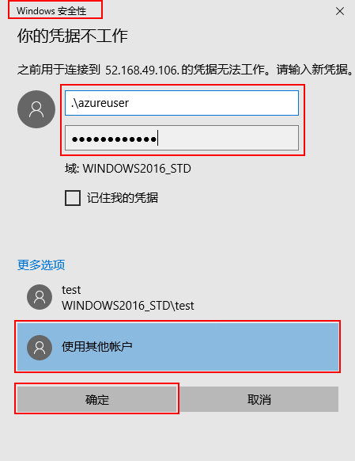

---
wts:
    title: '01 - 在门户中创建一个虚拟机'
    module: '模块 02 - 核心 Azure 服务'
---
# 01 - 在门户中创建一个虚拟机

在本演练中，我们将在 Azure 门户中创建一个虚拟机，连接到该虚拟机，安装 Web 服务器角色并进行测试。 

预计用时：45 分钟

**注意**：请在本演练中花些时间单击并阅读信息图标。 

# 任务 1：创建虚拟机

在此任务中，我们将创建 Windows Server 2016 Datacenter 虚拟机。 

1. 登录至 [Azure 门户](https://portal.azure.com)。

2. 搜索 **虚拟机**，然后单击 **+添加**。

3. 在 **基本信息** 选项卡中，填写信息。其他的均保留默认设置。

	| 设置 | 值 |
	|---|---|
	| 订阅 | **选择你的订阅**|
	| 资源组 | **myRGVM**（新建） |
	| 虚拟机名称 | **myVm** |
	| 地点 | **（美国）美国东部**|
	| 图像 | **Windows Server 2016 Datacenter**|
	| 管理员帐户用户名 | **azureuser** |
	| 管理员帐户密码 | **Pa$$w0rd1234**|
	| 入站端口规则 - 允许选择端口 | **RDP (3389)** 和 **HTTP (80)**|
	|||

4. 移动至“管理”选项卡的 **监视** 部分。

	|设置 | 值 |
	|---|---|
	|引导诊断 | **关闭**|
	|||

5. 保留其余默认值，然后选择页面底部的 **查看+创建** 按钮。

6. 验证通过后，点击 **创建** 按钮。部署虚拟机大约需要五到七分钟。

7. 你将在部署页面和 **通知** 图标（顶部菜单）处收到更新。

# 任务 2：连接到虚拟机

在此任务中，我们将使用 RDP 连接到新虚拟机。 

1. 搜索 **myVM** 并选择新虚拟机。

**注意**：你也可以使用 **通知** 中的 **转到资源** 链接。 

2. 在虚拟机 **概述** 页上，单击 **连接** 按钮。

    

    **注意**：以下说明介绍如何从 Windows 计算机连接到 VM。在 Mac 上，需要 RDP 客户端，例如 Mac App Store 的远程桌面客户端，在 Linux 虚拟机上，可使用 `ssh` 从 Bash Shell 直接连接。

2. 在 **连接到虚拟机** 页面中，保留默认选项，以便在端口 3389 使用公共 IP 地址进行连接，然后单击 **下载 RDP 文件**。

3. **打开** 下载的 RDP 文件，并在出现提示时单击 **连接**。 

    

4. 在 **Windows 安全** 窗口中，选择 **更多选项**，然后选择 **使用其他帐户**。提供用户名 (.\azureuser) 和密码 (Pa$$w0rd1234)。单击 **确定** 进行连接。

    


5. 在登录过程中，你可能会收到证书警告。单击 **是** 或创建连接并连接到已部署的VM。你应该成功连接。

    

恭喜！你已在 Azure 中部署并连接到 Windows Server 虚拟机

# 任务 3：安装 Web 服务器角色并进行测试

在此任务中，我们将在服务器上安装 Web 服务器角色，并确保可以显示默认的 IIS 欢迎页面。

1. 通过以下步骤在虚拟机上打开 PowerShell 命令提示符：单击 **开始** 按钮，键入 **PowerShell**，在菜单中右键单击 **Windows PowerShell** 并选择 **以管理员身份运行**。

    

2. 通过在 PowerShell 命令提示符中运行以下命令，在虚拟机中安装 **Web 服务器** 功能。可以复制并粘贴此命令。

```PowerShell
Install-WindowsFeature -name Web-Server -IncludeManagementTools
```
  
3. 完成后会看到一个值为 **True** 的提示符，指示 **成功**。你无需重启虚拟机即可完成安装。关闭与VM的RDP连接。

    

4. 返回门户，选择 VM，然后在该 VM 的 **概述** 窗格中，使用公共 IP 地址右侧的 **单击以复制** 按钮将其复制粘贴到浏览器标签页中。

    

5. 默认的 IIS Web 服务器欢迎页面将打开，并可通过此 IP 地址或完全限定的域名进行公开连接。

    

恭喜！你已创建可通过此 IP 地址或通过完全限定的域名公开连接的 Web 服务器。如果你有一个要托管的 Web 页面，则可以将这些源文件部署到虚拟机并进行托管，以便在已部署的虚拟机上进行公共访问。


**注**：为避免产生额外费用，你可以删除此资源组。搜索资源组，单击你的资源组，然后单击 **删除资源组**。验证资源组的名称，然后单击 **删除**。关注 **通知**，了解删除操作的进度。
