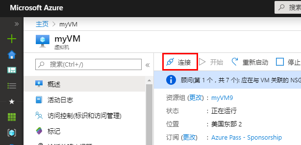
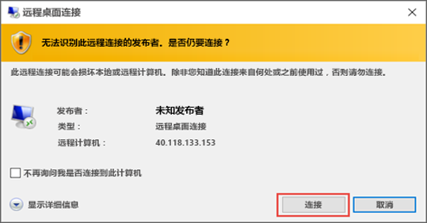
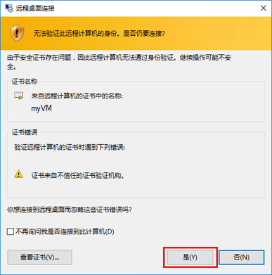
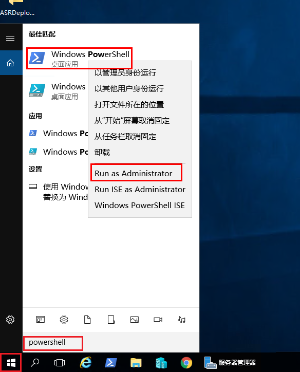
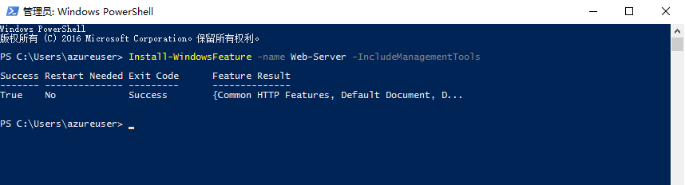
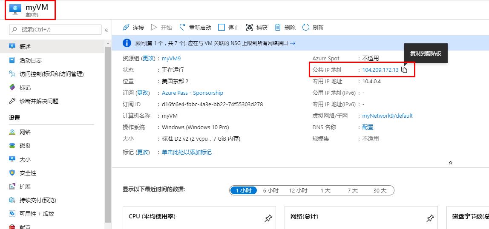

---
wts:
    title: '01 - 在门户中创建虚拟机（10 分钟）'
    module: '模块 02 - 核心 Azure 服务（工作负载）'
---
# 01 - 在门户中创建虚拟机（10 分钟）

在本演练中，我们将在 Azure 门户中创建一个虚拟机，连接到该虚拟机，安装 Web 服务器角色并进行测试。 

**备注**：请在本演练中花些时间单击并阅读信息图标。 

# 任务 1：创建虚拟机 
1. 登录到 Azure 门户：**https://portal.azure.com**

3. 从门户菜单中的“**所有服务**”边栏选项卡中，搜索并选择“**虚拟机**”，然后单击“**+ 添加**”、“**+ 创建**”、“**+ 新建**”，从下拉列表中选择“**+ 虚拟机**”。

4. 在“**基本**”选项卡上，填写以下信息（其他所有设置保留默认值）：

    | 设置 | 值 |
    |  -- | -- |
    | 订阅 | **使用提供的默认值** |
    | 资源组 | **创建新的资源组** |
    | 虚拟机名称 | **myVM** |
    | 区域 | **（美国）美国东部**|
    | 可用性选项 | 没有所需的基础结构冗余选项|
    | 图片 | **Windows Server 2019 Datacenter - Gen2**|
    | 大小 | **标准 D2s v3**|
    | 管理员帐户用户名 | **azureuser** |
    | 管理员帐号密码（请小心输入！） | **Pa$$w0rd1234**|
    | 入站端口规则 - | **允许选择端口**|
    | 选择入站端口 | **RDP (3389)** 和 HTTP (80)| 

5. 切换到网络选项卡以确保在“**选择入站端口**”部分中选择了“**HTTP (80) 和 RDP (3389)**”。

6. 切换到“**管理**”选项卡，然后在其“**监视**”部分中选择以下设置：

    | 设置 | 值 |
    | -- | -- |
    | 启动诊断 | **禁用**|

7. 将其余值保留为默认值，然后单击页面底部的“**查看 + 创建**”按钮。

8. 验证通过后，单击“**创建**”按钮。部署虚拟机大约需要五到七分钟。

9. 你将在部署页面和通过“**通知**”区域（顶部菜单栏中的钟形图标）收到更新。

# 任务 2：连接到虚拟机

在此任务中，我们将使用 RDP（远程桌面协议）连接到新虚拟机。 

1. 单击上方蓝色工具栏中的钟形图标，并在部署成功后选择“转到资源”。 

    **备注**: 你也可以使用“**部署**”页中的“转到资源”链接。 

2. 在虚拟机“**概述**”边栏选项卡上，单击“**连接**”按钮并从下拉列表中选择“**RDP**”。

    

    **备注**：以下说明介绍如何从 Windows 计算机连接到 VM。在 Mac 上，需要 RDP 客户端（例如 Mac App Store 中的此远程桌面客户端），而在 Linux 计算机上，可以使用开放源代码 RDP 客户端。

2. 在“**连接到虚拟机**”页面，保留默认选项，以便通过端口 3389 使用公共 IP 地址进行连接，然后单击“**下载 RDP 文件**”。屏幕左下角会下载一个文件。

3. **打开**下载的 RDP 文件（位于实验室计算机的左下角）并在出现提示时单击“**连接**”。 

    

4. 在“**Windows 安全**”窗口中，使用创建 VM **azureuser** 时使用的管理员凭据和密码 **Pa$$w0rd1234** 进行登录。 

5. 在登录过程中，你可能会收到证书警告。单击“**是**”或创建连接并连接到已部署的 VM。你应该成功连接。

    

新的虚拟机 (myVM) 将在你的实验室内启动。关闭弹出的服务器管理器和仪表板窗口（单击右上角的“x”）。此时会看到在虚拟机的蓝色背景。**恭喜！** 你已部署并连接到运行 Windows Server 的虚拟机。 

# 任务 3：安装 Web 服务器角色并进行测试

在此任务中，我们将在刚创建的虚拟机的服务器上安装 Web 服务器角色，并确保显示默认的 IIS 欢迎页面。 

1. 在新打开的虚拟机的搜索栏中，搜索 PowerShell 以启动 **PowerShell**，找到后依次右键单击“**Windows PowerShell**”和“**以管理员身份运行**”。

    

2. 在 PowerShell 中，通过运行以下命令在虚拟机上安装“**Web 服务器**”功能。 

    ```PowerShell
    Install-WindowsFeature -name Web-Server -IncludeManagementTools
    ```
  
3. 完成后会看到一个值为“**True**”的提示符，指示“**成功**”。你无需重启虚拟机即可完成安装。单击虚拟机顶部中心蓝色栏上的 **x**，关闭与 VM 的 RDP 连接。还可以单击顶部中心蓝色栏上的“**-**”将其最小化。

    

4. 返回门户，导航回 myVM 的“**概述**”边栏选项卡，然后使用“**单击复制到剪贴板**”按钮复制 myVM 的公共 IP 地址，打开新的浏览器选项卡，将该公共 IP 地址粘贴到 URL 文本框中，然后按 **Enter** 键以浏览到它。

    

5. 随即将显示默认的 IIS Web 服务器欢迎页面。

    

**恭喜！** 你已创建运行 Web 服务器的新 VM，该服务器可通过其公共 IP 地址进行访问。如果你有一个要托管的 Web 应用程序，则可以将这些应用程序文件部署到虚拟机并进行托管，以便在已部署的虚拟机上进行公共访问。


**备注**：为避免产生额外费用，你可以根据需要删除此资源组。搜索资源组，单击你的资源组，然后单击“**删除资源组**”。验证资源组的名称，然后单击“**删除**”。关注“**通知**”，了解删除操作的进度。
