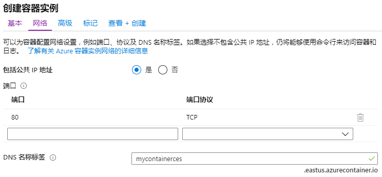

---
wts:
    title: '02 - 部署 Azure 容器实例'
    module: '模块 02 - 核心 Azure 服务'
---

# 02 - 部署 Azure 容器实例

在本演练中，我们将在 Azure 门户中创建和配置 Docker 容器，并将其部署到 Azure 容器实例 (ACI)。容器是显示静态 HTML 页面的“欢迎使用 ACI”Web 应用程序。 

预计用时：20 分钟。

# 任务 1：创建容器实例

在此任务中，我们将为 Web 应用程序创建一个新容器实例。 

1. 登录至 [Azure 门户](https://portal.azure.com)。

2. 搜索 **容器实例** 并单击 **+添加**。 

3. 为新容器实例提供以下基本详细信息。 

	| 设置| 数值|
	|----|----|
	| 订阅 | **选择你的订阅** |
	| 资源组 | **myRGContainer**（新建） |
	| 容器名称| **mycontainer**|
	| 区域 | **（美国）美国东部** |
	| 容器映像类型| **公共**|
	| 容器映像| **microsoft/aci-helloworld**|
	| 订阅 | **选择你的订阅**|
	| OS 类型| **Linux** |
	|||

4. 配置“网络”选项卡。将其余所有设置均保留为默认值。

	| 设置| 数值|
	|--|--|
	| DNS 名称标签| **mycontainerdnsxxx** （必须是唯一的） |
	|||
	
	**注意**：可以在 dns-name-label.region.azurecontainer.io 公开访问你的容器。如果你收到了 **DNS 名称标签不可用** 出错消息，请指定其他 DNS 名称标签。

	

5. 选择 **审阅并创建** 以启动自动验证流程。

6. 选择 **创建** 以创建容器实例。 

7. 监视部署页面和 **通知** 页面。 

8. 等待期间，你可能会想查看[这一简单应用程序背后的示例代码](https://github.com/Azure-Samples/aci-helloworld)。  浏览 \app 文件夹。 

# 任务 2：部署容器

在此任务中，我们将部署容器实例并确保显示欢迎页面。

1. 部署完成后，单击 **转到资源** 链接。

2. 在 **概述** 页面，确保容器的 **状态** 为 **正在运行**。 

3. 找到完全限定的域名 (FQDN)。

	

2. 将容器的 FQDN 复制到 Web 浏览器。将显示“欢迎”页面。 

	

**注意**：还可以在浏览器中使用容器的 IP 地址。 

恭喜！你已使用 Azure 门户将应用程序成功部署到 Azure 容器实例中的容器。

**注意**：为避免产生额外费用，你可以删除此资源组。搜索资源组，单击你的资源组，然后单击 **删除资源组**。验证资源组的名称，然后单击 **删除**。关注 **通知**，了解删除操作的进度。