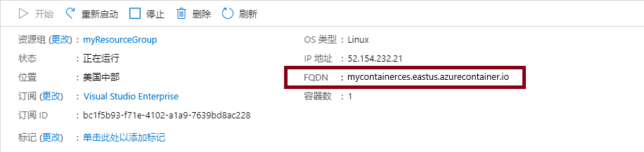
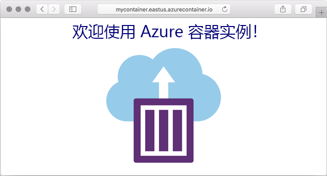

---
wts:
    title: '03 - 部署 Azure 容器实例（10 分钟）'
    module: '模块 02 - 核心 Azure 服务（工作负载）'
---

# 03 - 部署 Azure 容器实例（10 分钟）

在本演练中，我们将在 Azure 门户中使用 Azure 容器实例 (ACI) 创建、配置和部署容器。该容器是显示静态 HTML 页面的“欢迎使用 ACI”Web 应用程序。 

# 任务 1：创建容器实例 

在此任务中，我们将为 Web 应用程序创建一个新容器实例。 

1. 登录到 [Azure 门户](https://portal.azure.com)。

2. 从“**所有服务**”边栏选项卡，搜索并选择“**容器实例**”，然后单击“**+ 添加**”、“**+ 创建**”、“**+ 新建**”。 

3. 为新容器实例提供以下“基本”详细信息（其他所有设置保留默认值）： 

	| 设置| 值|
	|----|----|
	| 订阅 | ***使用提供的默认值*** |
	| 资源组 | **创建新的资源组** |
	| 容器名称| **mycontainer**|
	| 区域 | **（美国）美国东部** |
	| 映像源| **Docker Hub 或其他注册表**|
	| 映像类型| **公共**|
	| 映像| **mcr.microsoft.com/azuredocs/aci-helloworld**|
	| OS 类型| **Linux** |
	| 大小| **保留默认值**|

4. 配置“联网”选项卡（将 **xxxx** 替换为字母和数字，以使名称在全局范围内唯一）。将其余所有设置均保留为默认值。

	| 设置| 值|
	|--|--|
	| DNS 名称标签| **mycontainerdnsxxxxx** |

	
	**备注**：可以在 dns-name-label.region.azurecontainer.io 公开访问你的容器。如果在部署后收到“**DNS 名称标签不可用**”的错误消息，请指定其他 DNS 名称标签（替换 xxxxx）并重新部署。 

5. 单击 **“查看和创建”** 以启动自动验证流程。

6. 单击 **“创建”** 以创建容器实例。 

7. 监视部署页面和 **“通知”** 页面。 

# 任务 2：验证容器实例的部署

在此任务中，我们通过确保显示欢迎页面来验证容器实例正在运行。

1. 部署完成后，单击部署边栏选项卡上的 **“转到资源”** 链接或“通知”区域中的资源链接。

2. 在 **mycontainer** 的 **“概述”** 边栏选项卡，确保容器的 **“状态”** 为 **“正在运行”**。 

3. 找到完全限定的域名 (FQDN)。

	

2. 将容器的 FQDN 复制到新 Web 浏览器的选项卡中，然后按 **Enter** 键。将显示“欢迎”页面。 

	

**恭喜！** 你已使用 Azure 门户将应用程序成功部署到 Azure 容器实例中的容器。

**备注**：为避免产生额外费用，你可以根据需要删除此资源组。搜索资源组，单击你的资源组，然后单击“**删除资源组**”。验证资源组的名称，然后单击“**删除**”。关注“**通知**”，了解删除操作的进度。
