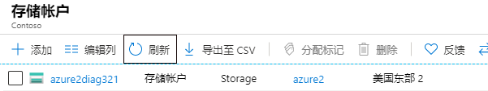
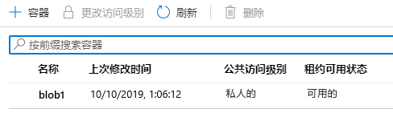
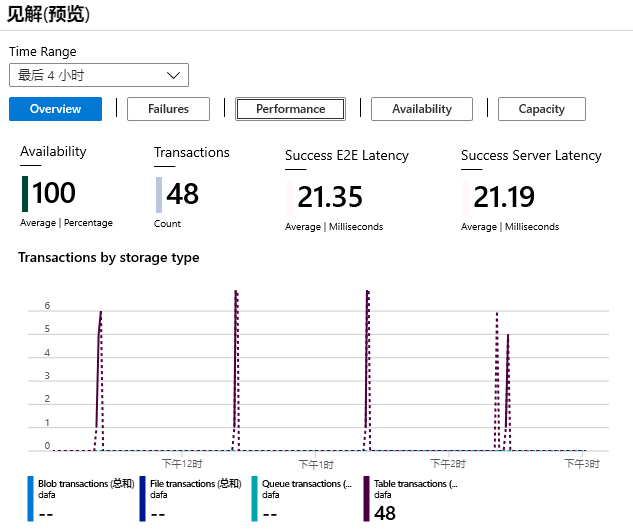

---
wts:
    title: '04 - 创建 Blob 存储'
    module: '模块 02 - 核心 Azure 服务'
---
# 04 - 创建 Blob 存储

在本演练中，我们将创建一个存储帐户，然后使用 Blob 存储文件。

预计用时：25 分钟。 

# 任务 1：创建存储帐户

在此任务中，我们将创建一个新存储帐户。 

1. 登录 Azure 门户网站：<a href="https://portal.azure.com" target="_blank">https://portal.azure.com</a>

2. 搜索并选择 **存储帐户**，然后单击 **+ 添加**。 

3. 使用以下详细信息完成 **创建存储帐户基本信息** 边栏选项卡。

    | 设置 | 数值 | 
    | --- | --- |
    | 订阅 | **选择你的订阅** |
    | 资源组 | **myRGStorage** （新建） |
    | 存储帐户名称:  | **storageaccountxxx** （必须是唯一的） |
    | 地点 | **(美国) 美国东部**  |
    | 性能 | **标准** |
    | 帐户类型： | **StorageV2（常规用途 v2）** |
    | 复制 | **本地冗余存储 (LRS)** |
    | 访问层（默认） | **热** |
    | | |

5. 选择 **查看创建** 检查存储帐户设置并允许 Azure 验证配置。 

6. 一旦验证选择 **创建**。等待帐户已成功创建的通知。 

7. 搜索 **存储帐户** 并确保已列出你的新存储帐户。

    

# 任务 2：使用 Blob 存储

在此任务中，我们将创建一个 Blob 容器并上传一个 Blob 文件。 

1. 单击新存储帐户并滚动到 **Blob** 服务部分，然后选择 **容器**。

2. 单击 **容器** 并完成信息。使用信息图标了解更多信息。完成后单击 **确定**。

    | 设置 | 数值 |
    | --- | --- |
    | 名称 | **blob1**  |
    | 公共访问级别| **专用（无匿名访问）** |
    | | |

    

4. 选择 **blob1** 容器，然后单击 **上传**。

5. 浏览到本地计算机上的文件。如果没有文件，创建一个简单的 `.txt` 文件。 

6. 单击 **高级** 箭头，保留默认值，但请记下你的选择，然后选择 **上传**。

    **注意**：你可以通过这种方式上传任意数量的 blob。新的 Blob 将在容器内列出。

7. 上传文件后，右键单击该文件，注意查看“编辑/查看”、“下载”、“Blob 属性”和“删除”等选项。 

8. 如果有时间，请返回存储帐户并查看“文件”、“表”和“队列”的选项。

# 任务 3：监视存储帐户

1. 返回主存储帐户页面。

2. 单击 **诊断并解决问题**。 

3. 了解一些最常见的存储问题。请注意，这里有疑难解答。

4. 单击 **见解(预览)**。请注意，这里有关于故障、性能、可用性和容量的信息。你的信息会有所不同。

    

恭喜！你已创建存储帐户，然后使用了 Blob 存储文件。

**注意**：为避免产生额外费用，你可以删除此资源组。搜索资源组，单击你的资源组，然后单击 **删除资源组**。验证资源组的名称，然后单击 **删除**。关注 **通知**，了解删除操作的进度。