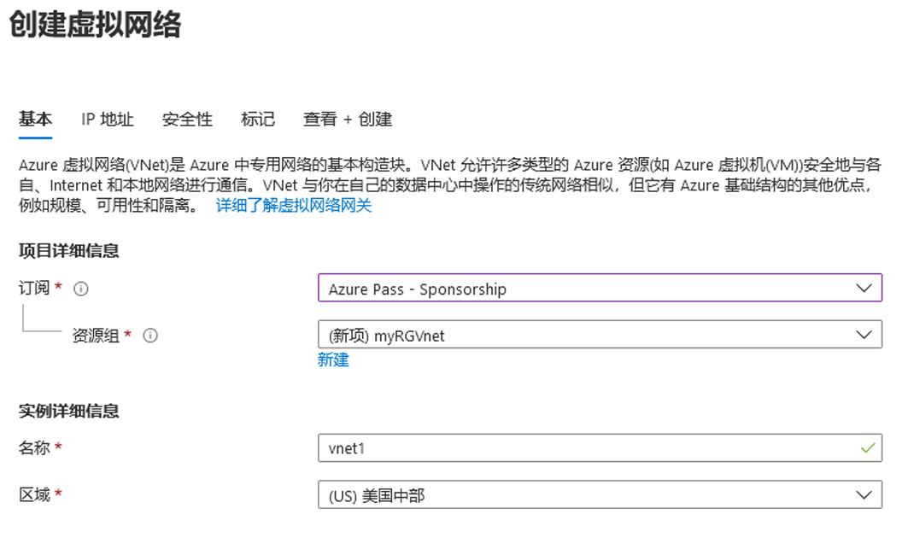
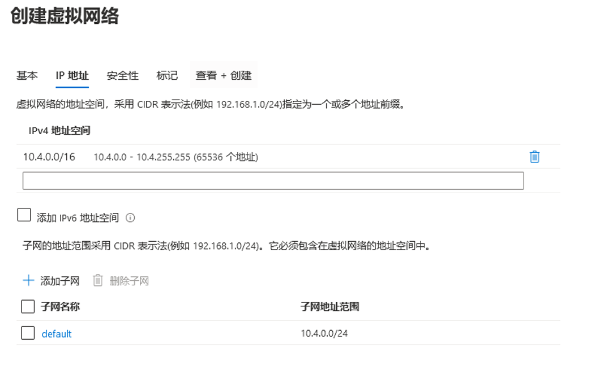

---
wts:
    title: '04 - 创建虚拟网络（20 分钟）'
    module: '模块 02 - 核心 Azure 服务（工作负载）'
---
# 04 - 创建虚拟网络

在本演练中，我们将创建一个虚拟网络，将两个虚拟机部署到该虚拟网络上，然后允许一台虚拟机 ping 该虚拟网络内的另一台虚拟机。

# 任务 1：创建虚拟网络（20 分钟）

在此任务中，我们将创建虚拟网络。 

1. 登录 Azure 门户：<a href="https://portal.azure.com" target="_blank"><span style="color: #0066cc;" color="#0066cc">https://portal.azure.com</span></a>

2. 在 **“所有服务”** 边栏选项卡中，搜索并选择 **“虚拟网络”**，然后单击 **“+ 添加、+ 创建或 + 新建”**。 

3. 在 **“创建虚拟网络”** 边栏选项卡上，填写以下信息（其他所有设置保留默认值）：

    | 设置 | 值 | 
    | --- | --- |
    | 订阅 | **选择你的订阅** |
    | 资源组 | **myRGVNet** （新建） |
    | 名称 | **vnet1** |
    | 位置 | **（美国）美国东部** |
    | 地址空间 |**10.1.0.0/16** |
    | 子网 - 名称 | **默认值** |
    | 子网地址范围 | **10.1.0.0/24** |

    
    

5. 单击 **“查看 + 创建”按钮**。确保验证通过。

6. 单击 **“创建”** 按钮以部署虚拟网络。 

    **备注**： 在你的组织中，如何了解自己将需要哪些虚拟网络和 IP 地址？

# 任务 2：创建两个虚拟机

在此任务中，我们将在虚拟网络中创建两个虚拟机。 

1. 在 **“所有服务”** 边栏选项中，搜索并选择 **“虚拟机”**，然后单击 **“+ 添加”** 并选择 **“+ 虚拟机”**。 

2. 在 **“基本”** 选项卡上，填写以下信息（其他所有设置保留默认值）：

   | 设置 | 值 | 
   | --- | --- |
   | 订阅 | **选择你的订阅**  |
   | 资源组 |  **myRGVNet** |
   | 虚拟机名称 | **vm1**|
   | 区域 | **（美国）美国东部** |
   | 映像 | **Windows Server 2019 Datacenter** |
   | 用户名| **azureuser** |
   | 密码| **Pa$$w0rd1234** |
   | 公共入站端口| 选择 **“允许选定的端口”** |
   | 选定的入站端口| **RDP (3389)** |
   |||

3. 选择 **“联网”** 选项卡。确保虚拟机位于 vnet1 虚拟网络中。查看默认设置，但不要进行任何其他更改。 

   | 设置 | 值 | 
   | --- | --- |
   | 虚拟网络 | **vnet1** |
   |||

4. 单击 **“查看 + 创建”**。验证通过后，单击 **“创建”**。部署时间可能有所不同，通常需要三到六分钟才能完成部署。

5. 监视你的部署，同时继续执行下一步。 

6. 通过重复上述步骤 **2 至 4** 创建第二个虚拟机。请务必使用其他虚拟机名称，并确保该虚拟机位于同一虚拟网络中，并且使用新的公共 IP 地址：

    | 设置 | 值 |
    | --- | --- |
    | 资源组 | **myRGVNet** |
    | 虚拟机名称 |  **vm2** |
    | 虚拟网络 | **vnet1** |
    | 公共 IP | （新） **vm2-ip** |
    |||

7. 等待这两个虚拟机完成部署。 

# 任务 3：测试连接 

在此任务中，我们将允许登录一台 VM 并 ping 另一台 VM。 

1. 在 **“所有资源”** 边栏选项卡中，搜索 **“vm1”**，打开其 **“概述”** 边栏选项卡，并确保其 **“状态”** 为 **“正在运行”**。你可能需要**刷新**页面。

2. 在 **“概述”** 边栏选项卡上，单击 **“连接”** 按钮。

    **备注**： 以下说明介绍如何从 Windows 计算机连接到 VM。 

3. 在 **“连接到虚拟机”** 边栏选项卡上，保留默认选项，按 IP 地址通过端口 3389 进行连接，然后单击 **“下载 RDP 文件”**。

4. 打开下载的 RDP 文件，并在出现提示时单击 **“连接”**。 

5. 在 **“Windows 安全性”** 窗口中，键入用户名 **“azureuser”** 和密码 **“Pa$$w0rd1234”**，然后单击 **“确定”**。

6. 在登录过程中，你可能会收到证书警告。单击 **“是”** 或创建连接，并连接到已部署的 VM。你应该成功连接。

7. 通过以下步骤在虚拟机上打开 PowerShell 命令提示符：单击 **“开始”** 按钮，键入 **“PowerShell”**，在右键菜单中右键单击 **“Windows PowerShell”**，再单击 **“以管理员身份运行”**。

8. 在 Powershell 中键入以下命令，以尝试与 vm2 通信，你会注意到可以成功通信。

   ```PowerShell
   ping vm2
   ```

恭喜！你已在虚拟网络中配置并部署了两个虚拟机。并且已经测试了可以在两台 VM 之间通信。 

**备注**： 为避免产生额外费用，你可以删除此资源组。搜索资源组，单击你的资源组，然后单击 **“删除资源组”**。验证资源组的名称，然后单击 **“删除”**。关注 **“通知”**，了解删除操作的进度。
