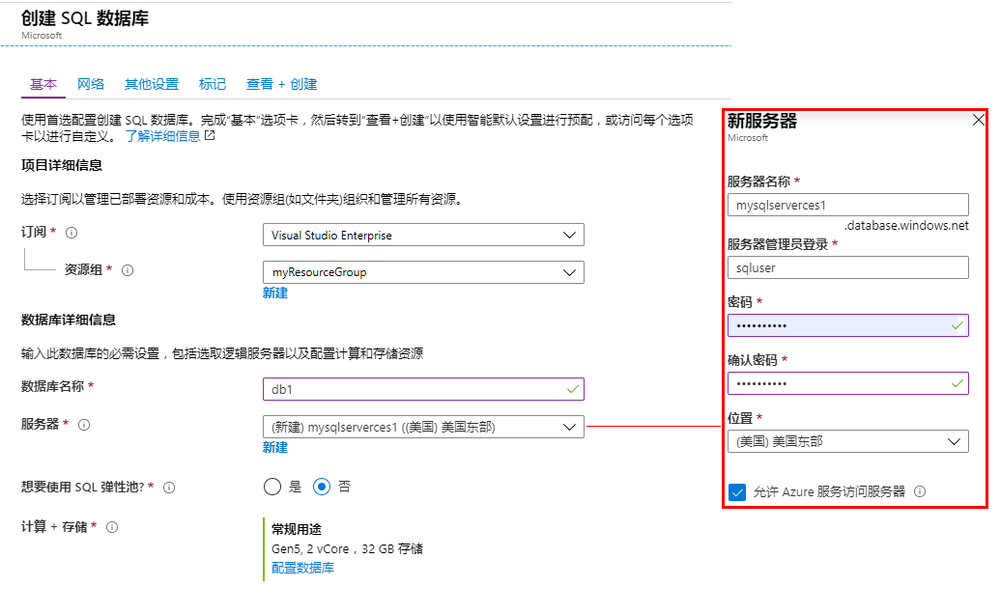
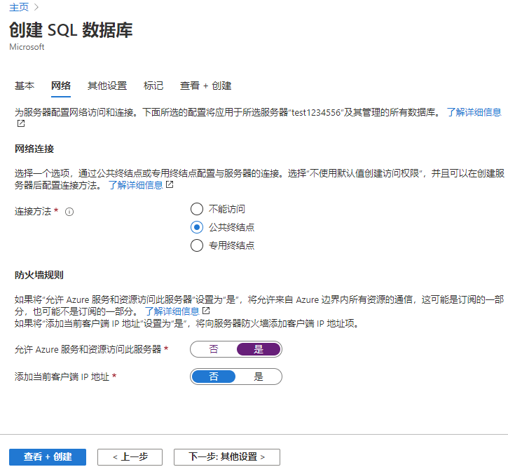
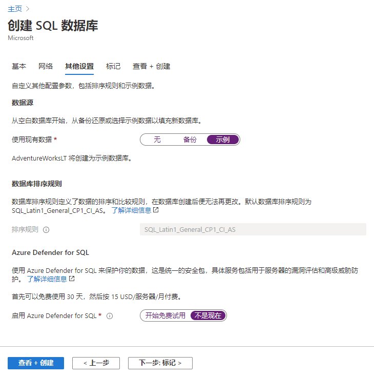
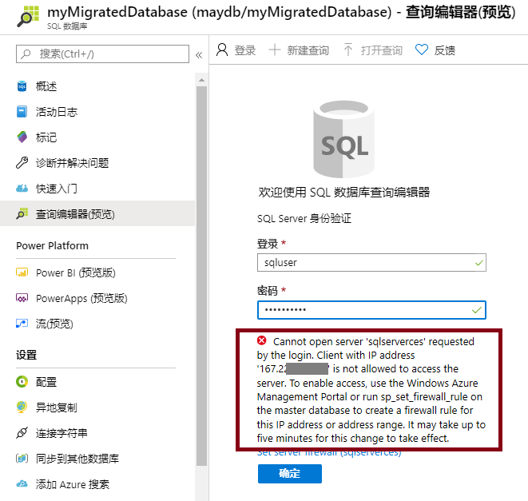
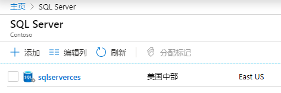
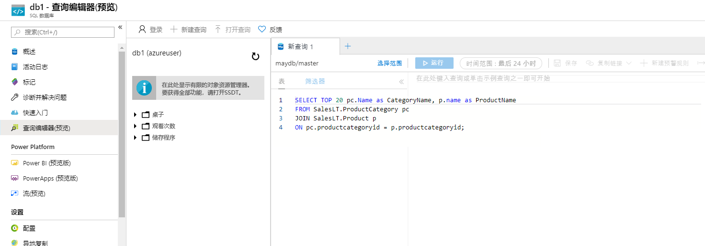
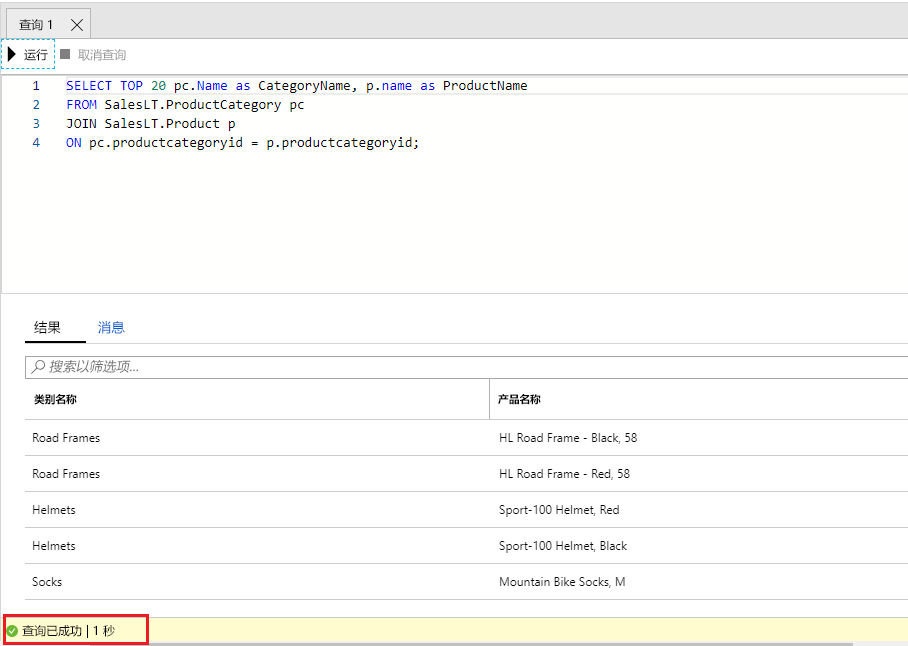

---
wts:
    title: '06 - 创建 SQL 数据库（5 分钟）'
    module: '模块 02 - 核心 Azure 服务（工作负载）'
---

# 06 - 创建 SQL 数据库（5 分钟）

在本演练中，我们将在 Azure 中创建一个 SQL 数据库，然后查询该数据库中的数据。

# 任务 1：创建数据库 

在此任务中，我们将基于“AdventureWorksLT”示例数据库创建 SQL 数据库。 

1. 登录至 Azure 门户，网址：[https://portal.azure.com](https://portal.azure.com)

2. 从“**所有服务**”边栏选项卡，搜索并选择“**SQL 数据库**”，然后单击“**+ 添加**”、“**+ 创建**”、“**+ 新建**”。 

3. 在“**基本**”选项卡中，填写以下信息。  

    | 设置 | 值 | 
    | --- | --- |
    | 订阅 | **使用提供的默认值** |
    | 资源组 | **创建新的资源组** |
    | 数据库名称| **db1** | 
    | 服务器 | 选择“**新建**”（右侧会打开一个新的侧边栏）|
    | 服务器名称 | **sqlserverxxxx**（必须是唯一的） | 
    | 服务器管理员登录名 | **sqluser** |
    | 密码 | **Pa$$w0rd1234** |
    | 位置 | **（美国）美国东部** |
    | 单击  | **确定** |

   

4. 在“**网络**”选项卡上，配置以下设置（其他设置保留为默认值）

    | 设置 | 值 | 
    | --- | --- |
    | 连接方法 | **公共终结点** |    
    | 允许 Azure 服务和资源访问此服务器 | **是** |
    | 添加当前客户端 IP 地址 | **否** |
    
   

5. 在“**安全**”选项卡上。 

    | 设置 | 值 | 
    | --- | --- |
    | Azure Defender for SQL| **以后再说** |
    
6. 前往“**其他设置**”选项卡。我们将使用 AdventureWorksLT 示例数据库。

    | 设置 | 值 | 
    | --- | --- |
    | 使用现有数据 | **示例** |

    

7. 单击“**查看 + 创建**”，然后单击“**创建**”以部署和预配资源组、服务器和数据库。部署大约需要 2 到 5 分钟。


# 任务 2：测试数据库。

在此任务中，我们将配置 SQL Server 并运行 SQL 查询。 

1. 部署完成后，在部署边栏选项卡单击“前往资源”。或者，在“**所有资源**”边栏选项卡中搜索并选择“**数据库**”，然后 **SQL 数据库**可确保已创建新数据库。你可能需要**刷新**页面。

    

2. 单击代表你创建的 SQL 数据库的“**db1**”条目。在 db1 边栏选项卡中，单击“**查询编辑器(预览版)**”。

3. 使用密码“**Pa$$w0rd1234**”以 **sqluser** 身份登录。

4. 你将无法登录。请仔细阅读错误，并记下需要允许通过防火墙的 IP 地址。 

    

5. 返回“**db1**”边栏选项卡，单击“**概览**”。 

    

6. 在 db1“**概览**”边栏选项卡中，单击位于概览屏幕顶部中央的“**设置服务器防火墙**”。

7. 单击“**+ 添加客户端 IP**”（顶部菜单栏），然后添加错误中引用的 IP 地址。（它可能已为你自动填充 - 如果没有将其粘贴到 IP 地址字段中）。请务必**保存**更改。 

    

8. 回到 SQL 数据库（向左滑动底部切换栏）并单击“**查询编辑器(预览版)**”。尝试使用密码“**Pa$$w0rd1234**”以 **sqluser** 身份重新登录。此次应尝试成功。请注意，部署新的防火墙规则可能需要几分钟时间。 

9. 成功登录后，系统将显示查询窗格。在编辑器窗格中输入以下查询。 

    ```SQL
    SELECT TOP 20 pc.Name as CategoryName, p.name as ProductName
    FROM SalesLT.ProductCategory pc
    JOIN SalesLT.Product p
    ON pc.productcategoryid = p.productcategoryid;
    ```

    

10. 单击“**运行**”，然后在“**结果**”窗格中查看查询结果。查询应会成功运行。

    

恭喜！你已在 Azure 中创建了一个 SQL 数据库，并成功查询了该数据库中的数据。

**备注**：为避免产生额外费用，你可以根据需要删除此资源组。搜索资源组，单击你的资源组，然后单击“**删除资源组**”。验证资源组的名称，然后单击“**删除**”。关注“**通知**”，了解删除操作的进度。
