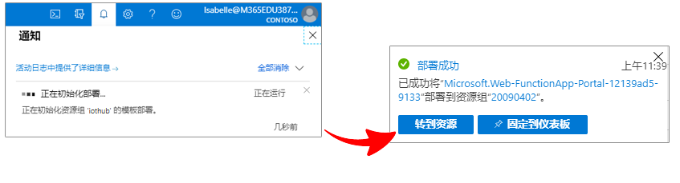
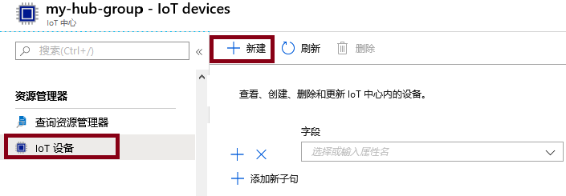
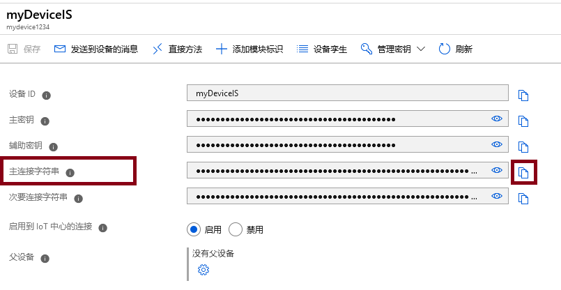
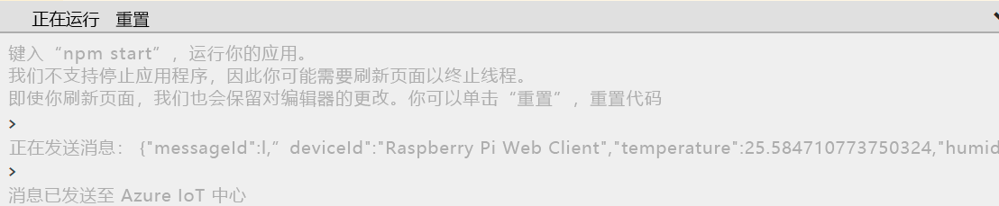
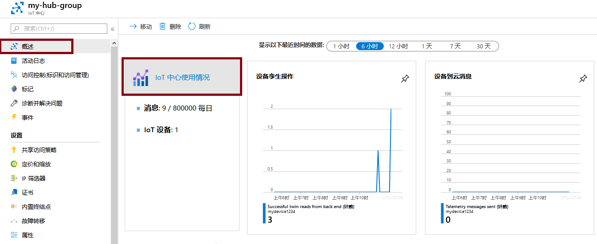

---
wts:
    title: '07 - 实现 Azure IoT 中心（10 分钟）'
    module: '模块 03：描述核心解决方案和管理工具'
---
# 07 - 实现 Azure IoT 中心（10 分钟）

在本演练中，我们将在 Azure 门户中配置新的 Azure IoT 中心，并使用在线 Raspberry Pi 设备模拟器验证与 IoT 设备的连接。传感器数据和消息从 Raspberry Pi 模拟器传递到 Azure IoT 中心，你可以在 Azure 门户中查看消息传送活动的指标。

# 任务 1：创建一个 IoT 中心 

在此任务中，我们将创建一个 IoT 中心。 

1. 登录到 [Azure 门户](https://portal.azure.com)。

2. 从“**所有服务**”边栏选项卡，搜索并选择“**IoT 中心**”，然后单击“**+ 添加**”、“**+ 创建**”、“**+ 新建**”。

3. 在 **“IoT 中心”** 边栏选项卡的 **“基本”** 选项卡上，在字段中填写以下详细信息（将存储帐户名称中的 **“xxxx”** 替换为字母和数字，使该名称在全局范围内唯一）：

    | 设置 | 值 |
    |--|--|
    | 订阅 | **保留提供的默认值** |
    | 资源组 | **创建新的资源组** |
    | 区域 | **美国东部** |
    | IoT 中心名称 | **my-hub-groupxxxxx** |

    **备注**- 请记住更改 **xxxxx** 以使其成为唯一的 **IoT 中心名称**。

4. 转到“**管理**”选项卡，使用下拉列表将“**定价和规模层**”设置为“**S1: 标准层**”。

5. 单击 **“查看 + 创建”** 按钮。

6. 单击 **“创建”** 按钮开始创建新的 Azure IoT 中心实例。

7. 等待 Azure IoT 中心实例部署完成。 

# 任务 2：添加 IoT 设备

在此任务中，我们将 IoT 设备添加到 IoT 中心。 

1. 部署完成后，在部署边栏选项卡单击 **“前往资源”**。或者，在 **“所有服务”** 边栏选项卡中，搜索并选择 **“IoT 中心”**，然后找到新的 IoT 中心实例

	

2. 要添加新的 IoT 设备，请向下滚动到“**资源管理器**”部分并单击“**IoT 设备**”。然后，单击“**+ 添加**”、“**+ 创建**”、“**+ 新建**”。

	

3. 将新 IoT 设备命名为 **“myRaspberryPi”**，然后单击 **“保存”** 按钮。这将在 Azure IoT 中心中创建新的 IoT 设备标识。

4. 如果看不到新设备，请 **“刷新”** IoT 设备页面。 

5. 选择 **“myRaspberryPi”** 并复制 **“主连接字符串”** 值。你将在下一任务中使用此密钥来验证与 Raspberry Pi 模拟器的连接。

	

# 任务 3：使用 Raspberry Pi 模拟器测试设备

在此任务中，我们将使用 Raspberry Pi 模拟器测试设备。 

1. 在 Web 浏览器中打开一个新的选项卡，然后键入此快捷链接 https://aka.ms/RaspPi。你会进入 Raspberry Pi 模拟器站点。如果有时间，请阅读有关 Raspberry Pi 模拟器的信息。完成后选择“X”关闭弹出窗口。

2. 在右侧的编码区域中，找到带有'const connectionString ='的行。将它替换你在 Azure 门户中复制的连接字符串。请注意，连接字符串包含 DeviceId (**myRaspberryPi**) 和 SharedAccessKey 条目。

	

3. 单击“**运行**”（代码区域下方）以运行应用程序。控制台输出应显示从 Raspberry Pi 模拟器发送到 Azure IoT 中心的传感器数据和消息。每次 Raspberry Pi 模拟器 LED 闪烁时，都会发送数据和消息。 

	

5. 选择“**停止**”以停止发送数据。

6. 返回 Azure 门户。

7. 切换到 IoT 中心“**概览**”边栏选项卡并向下滚动到“**IoT 中心使用情况**”信息以查看使用情况。更改“**显示过去某段时间的数据**”中的时间范围以查看过去一小时的数据。

	

恭喜！你已设置 Azure IoT 中心来从 IoT 设备收集传感器数据。

**备注**：为避免产生额外费用，你可以根据需要删除此资源组。搜索资源组，单击你的资源组，然后单击“**删除资源组**”。验证资源组的名称，然后单击“**删除**”。关注“**通知**”，了解删除操作的进度。
