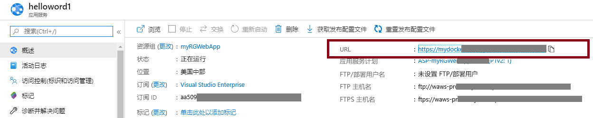
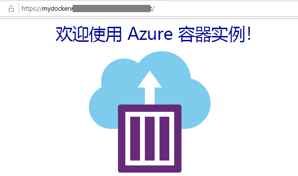

---
wts:
    title: '08 - 创建 Web 应用'
    module: '模块 02 - 核心 Azure 服务'
---
# 08 - 创建 Web 应用

在本演练中，我们将创建一个运行 Docker 容器的新 Web 应用。容器显示一条“Welcome”消息。 

预计用时：25 分钟。 

# 任务 1：创建 Web 应用

Azure 应用服务实际上是四种服务的集合，所有这些服务都旨在帮助你托管和运行 Web 应用程序。这四种服务（Web 应用、移动应用、API 应用和逻辑应用）看起来有所不同，但最终都以非常类似的方式运行。Web 应用是这四种服务中最为常用的服务，并且是我们在本实验中将要使用的服务。

在此任务中，你将创建一个 Azure 应用服务 Web 应用。 

1. 登录至 [Azure 门户](http://portal.azure.com/)。 

2. 搜索并选择 **应用程序服务**。

3. 单击 **+ 添加** 并配置 Web 应用。对于应用服务计划，请采用默认值。 

    | 设置 | 数值 |
    | -- | -- |
    | 订阅 | **选择你的订阅** |
    | 资源组 | **myRGWebApp1** （新建） |
    | 名称 | **myDockerWebAppxxx** （必须是唯一的） |
    | 发布 | **Docker 容器** |
    | 操作系统 | **Linux** |
    | 区域 | **美国东部** （忽略任何服务计划可用性警告） |
    | | |	

4. 单击 **下一步 > Docker**，并配置容器信息。启动命令为可选命令，本练习无需此命令。 

    **注意：**该容器与“容器实例”演练中用于显示 Hello World 消息的容器相同。 

    | 设置 | 数值 |
    | -- | -- |
    | 选项 | **单个容器** |
    | 图像来源 | **Docker Hub** |
    | 访问类型 | **公共** |
    | 图像和标记 | **microsoft/aci-helloworld** |
    | | |	

5. 单击 **查看 + 创建**，然后再单击 **创建**。 

# 任务 2：测试 Web 应用

在此任务中，我们将测试 Web 应用。

1. 等待 Web 应用进行部署。

2. 从 **通知** 中单击 **转到资源**。 

3. 在 **属性** 边栏选项卡中，找到 **URL**。 

    

4. 单击 **URL**，Docker 容器将运行，并且将显示“Azure 容器实例”页面。

    

5. 请注意，Web 应用的 **概述** 页面具有几个图表。如果多次运行该 URL，可以开始查看访问信息。这包括请求数和平均响应时间。 

**注意**：为避免产生额外费用，你可以删除此资源组。搜索资源组，单击你的资源组，然后单击 **删除资源组**。验证资源组的名称，然后单击 **删除**。关注 **通知**，了解删除操作的进度。

