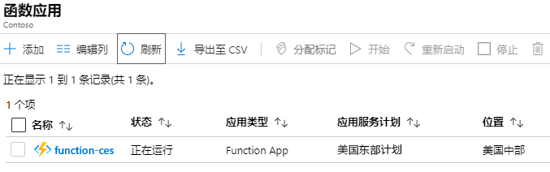
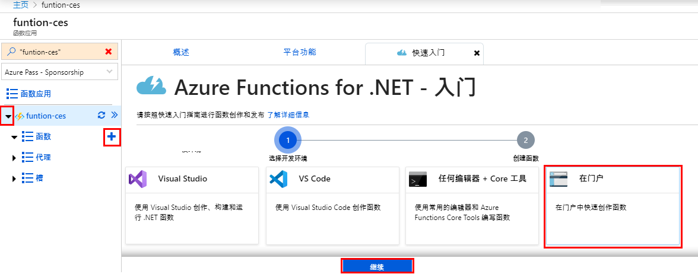
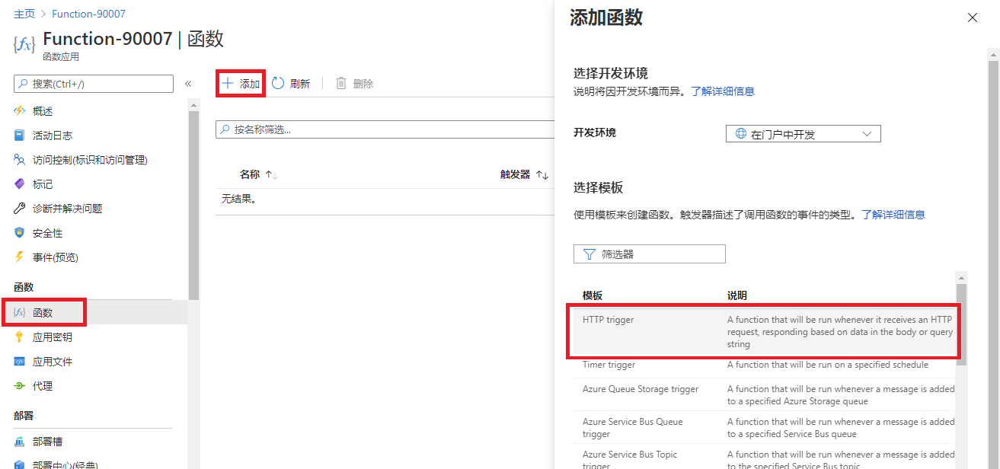
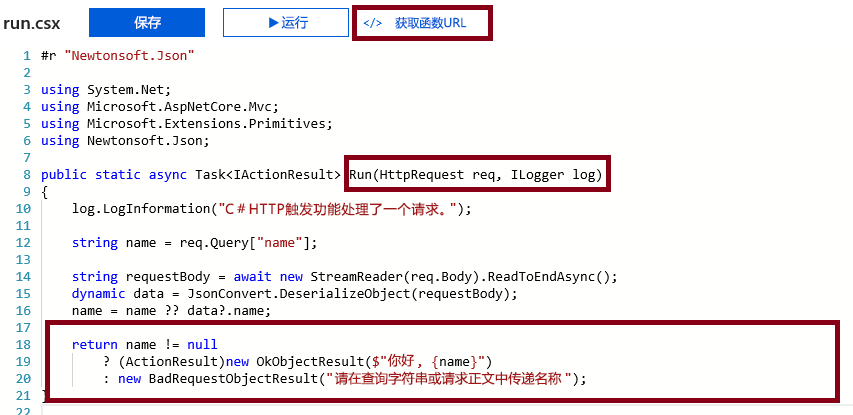
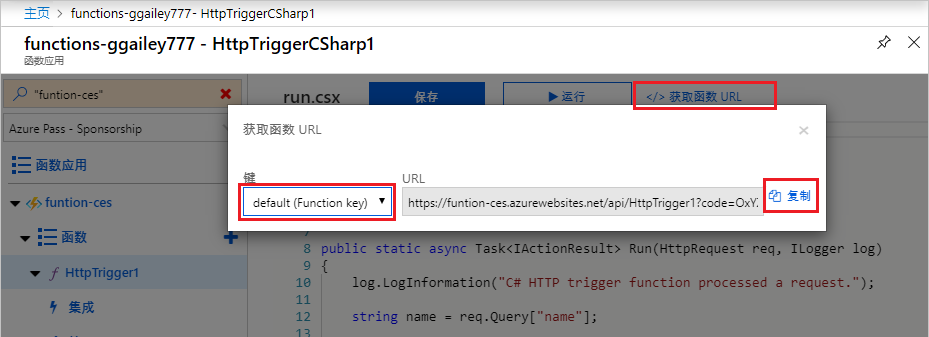
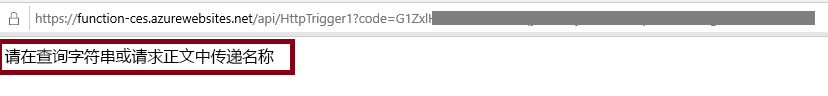
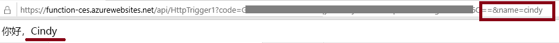
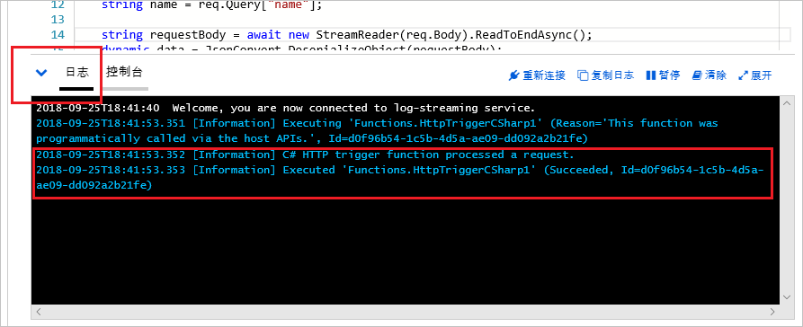

---
wts:
    title: '08 - 实现 Azure Functions（5 分钟）'
    module: '模块 03：描述核心解决方案和管理工具'
---
# 08 - 实现 Azure Functions

在本演练中，我们将创建一个函数应用，用于在出现 HTTP 请求时显示 Hello 消息。 

# 任务 1：创建一个函数应用（5 分钟）

在此任务中，我们将创建一个函数应用。

1. 登录至 [Azure 门户](https://portal.azure.com)。

1. 在门户顶部的 **“搜索资源、服务和文档”** 文本框中，搜索并选择 **“函数应用”**，然后从 **“函数应用”** 边栏选项卡中单击 **“+ 添加”**。

1. 在 **“函数应用”** 边栏选项卡的 **“基本”** 选项卡上，指定以下设置（用字母和数字替换应用名称中的 **“xxxx”**，使得该名称具有全局唯一性，所有其他设置保留默认值）。 

    | 设置 | 值 |
    | -- | --|
    | 订阅 | 你的 Azure 订阅名 |
    | 资源组 | 新资源组的名称 **“myRGFunction”**|
    | 函数应用名称 | **function-xxxx** |
    | 发布 | **代码** |
    | 运行时堆栈 | **.NET Core** |
    | 版本 | **3.1** |
    | 区域 | **美国东部** |
    | | |

    **备注** - 请记住更改 **xxxx** 以获得唯一的函数应用名称

1. 单击 **“查看 + 创建”**，验证成功后单击 **“创建”**，以开始预配和部署新的 Azure 函数应用。

1. 等待资源已创建的通知。

1. 导航回 **“函数应用”** 边栏选项卡，单击 **“刷新”**，验证新创建的函数应用的状态是否为 **“正在运行”**。 

    

# 任务 2：创建一个 HTTP 触发函数并对其进行测试

在此任务中，我们将通过 Webhook + API 函数在出现 HTTP 请求时显示消息。 

1. 在 **“函数应用”** 边栏选项卡上，单击新创建的函数应用。 

1. 在 **“函数应用”** 边栏选项卡的“函数”部分，单击“函数”，然后单击 **“+ 添加”**。

    
    
1. 在“新建函数”边栏选项卡的 **“模板”** 选项卡上，单击 **“HTTP 触发器”**。 

    
    
1. 在 **“新建函数”** 边栏选项卡的 **“详细信息”** 选项卡上，接受默认的 **“新建函数”** 名称和 **“授权级别”**，然后单击 **“创建函数”**。 

    
    
1. 在 **“HttpTrigger1”** 边栏选项卡的 **“开发人员”** 部分，单击 **“代码 + 测试”**。 

1. 在 **“HttpTrigger1 \| 代码 + 测试”** 边栏选项卡上，查看自动生成的代码，并注意该代码旨在运行 HTTP 请求和日志信息。另请注意，该函数将返回包含名称的 Hello 消息。 

    

1. 从函数编辑器顶部选择 **获取函数 URL**。 

1. 将 **键** 下拉列表的值设置为 **默认值(功能键)**。然后，选择 **复制** 以复制功能 URL。 

    

1. 将复制的函数 URL 粘贴到 Web 浏览器的地址栏中。当请求该页面时，该函数将运行。请注意指示该函数需要一个名称的消息。 

    

1. 将 **&name=*yourname*** 追加到 URL 的末尾。 

    **注意**：在这里，***yourname*** 是指你指定的名字。最终 URL 将类似于 `https://azfuncxxx.azurewebsites.net/api/HttpTrigger1?code=X9xx9999xXXXXX9x9xxxXX==&name=cindy`

    

1. 在函数运行时，跟踪信息将写入 Azure 中的日志文件。要在 Azure 门户中查看日志，请返回到功能编辑器，然后选择 **日志** 按钮。

    

恭喜！你已创建一个函数应用，当出现 HTTP 请求时，它会显示 Hello 消息。 

**注意**：为避免产生额外费用，你可以删除此资源组。搜索资源组，单击你的资源组，然后单击 **删除资源组**。验证资源组的名称，然后单击 **删除**。关注 **通知**，了解删除操作的进度。
