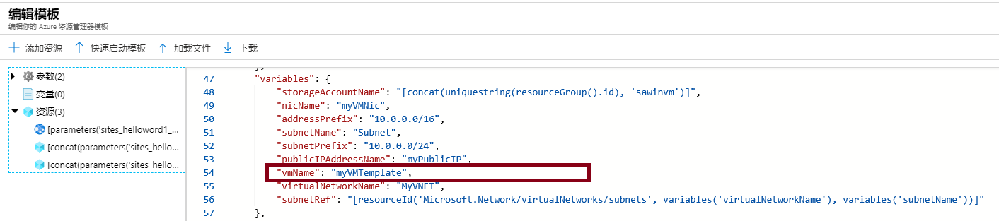
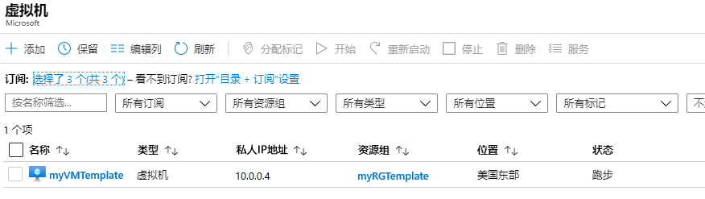
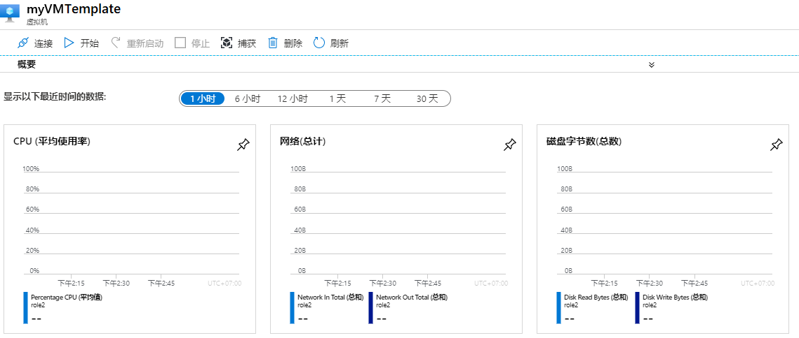
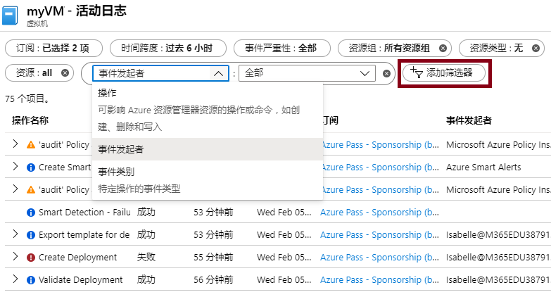

---
wts:
    title: '09 - 使用模板创建 VM（10 分钟）'
    module: '模块 03：描述核心解决方案和管理工具'
---
# 09 - 使用模板创建 VM

在本演练中，我们将使用快速启动模板部署虚拟机并检查监视功能。

# 任务 1：探索库并找到模板（10 分钟）

在此任务中，我们将浏览 Azure 快速启动库并部署可创建虚拟机的模板。 

1. 在浏览器中，访问 [Azure 快速启动模板库](https://azure.microsoft.com/resources/templates?azure-portal=true)。在该库中，你将找到许多最近更新的热门模板。这些模板可自动部署 Azure 资源，包括安装常用软件包。

2. 浏览多种不同类型的可用模板。 

    **备注**：是否有你感兴趣的模板？

3. 搜索或直接访问[部署虚拟机](https://azure.microsoft.com/resources/templates/101-vm-simple-windows?azure-portal=true)模板。

    **备注**： **“部署到 Azure”** 按钮使你能够通过 Azure 门户部署模板。在此类部署过程中，系统将仅提示你输入少量的配置参数。 

4. 单击 **“部署到 Azure”** 按钮。浏览器会话将自动重定向到 [Azure 门户](http://portal.azure.com/)。

5. 如果系统出现提示，请登录到你要在本实验室中使用的 Azure 订阅。

6. 单击 **“编辑模板”**。资源管理器模板使用 JSON 格式。查看参数和变量。然后找到虚拟机名称对应的参数。将名称更改为 **“myVMTemplate”**。**“保存”** 更改。你将返回到 Azure 门户中的 **“自定义部署”** 边栏选项卡。

    

7. 在 **“自定义部署”** 边栏选项卡上，配置模板所需的参数（将 DNS 标签前缀中的 ***“xxxx”*** 替换为字母和数字，以使标签在全局范围内唯一）。其他参数保留默认值。 

    | 设置| 值|
    |----|----|
    | 订阅 | **选择你的订阅**|
    | 资源组 | **myRGTemplate**（新建） |
    | 位置 | **（美国）美国东部** |
    | 管理员用户名 | **azureuser** |
    | 管理员密码 | **Pa$$w0rd1234** |
    | DNS 标签前缀 | **myvmtemplate*xxxx*** |
    | Windows OS 版本 | **2019-Datacenter** |
    | | |
    
    **备注**：此模板不收取任何费用。

9. 单击 **“查看 + 创建”**。

10. 监视你的部署。 

# 任务 2：验证和监视虚拟机部署

在此任务中，我们将验证虚拟机是否已正确部署。 

1. 从 **“所有服务”** 边栏选项卡，搜索并选择 **“虚拟机”**。

2. 确保已创建新的虚拟机。 

    

3. 选择你的虚拟机，然后在 **“概述”** 窗格向下滚动以查看监视数据。

    **备注**：监视时间范围可以在 1 小时和 30 天之间进行调整。

4. 查看提供的不同图表，包括 **CPU（平均值）**、**网络（总计）** 和 **磁盘字节（总计）**。 

    

5. 单击任何图表。注意，你可以 **“添加指标”** 并更改图表类型。

6. 返回 **“概述”** 边栏选项卡。

7. 单击 **“活动日志”** （左窗格）。活动日志记录创建或修改资源等事件。 

8. 单击 **“添加筛选器”**，并尝试搜索其他事件类型和操作。 

    

**备注**：为避免产生额外费用，你可以删除此资源组。搜索资源组，单击你的资源组，然后单击 **“删除资源组”**。验证资源组的名称，然后单击 **“删除”**。关注 **“通知”**，了解删除操作的进度。
