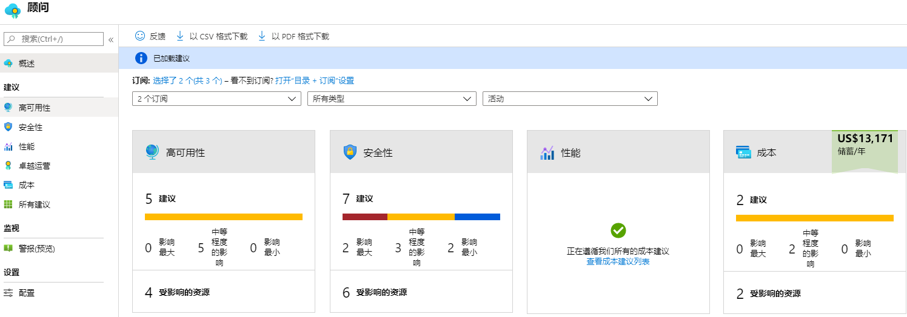
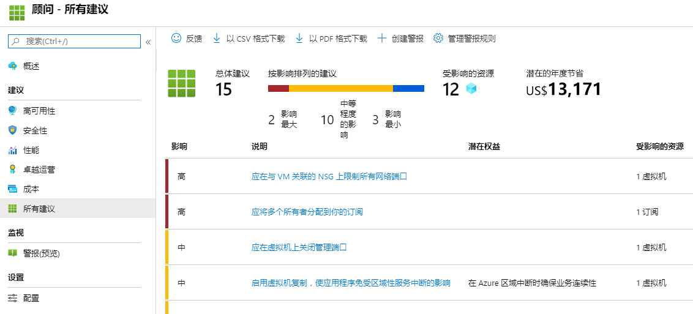

---
wts:
    title: '11 - 使用 CLI 创建 VM（10 分钟）'
    module: '模块 03：描述核心解决方案和管理工具'
---
# 11 - 使用 CLI 创建 VM

在本演练中，我们将在本地安装 Azure CLI、创建资源组和虚拟机、使用 Cloud Shell，以及查看 Azure 顾问建议。 

# 任务 1：配置 Cloud Shell（10 分钟）

在此任务中，我们将配置 Cloud Shell。 

1. 登录至 [Azure 门户](https://portal.azure.com)。

2. 单击 Azure 门户右上方的图标，从 Azure 门户中打开 **Azure Cloud Shell**。

    

3. 如果你之前使用过 Cloud Shell，请继续执行下一个任务。 

4. 当提你选择 **“Bash”** 或 **“PowerShell”** 时，选择 **“Bash”**。 

5. 出现提示时，单击 **“创建存储”**，并等待 Azure Cloud Shell 初始化。 

# 任务 2：创建资源组和虚拟机

在此任务中，我们将使用 Azure CLI 创建资源组和虚拟机。  

1. 确保 **“Bash”** 在 **“Cloud Shell”** 窗格左上方的下拉菜单中为选中状态（如果不是，请将其选中）。

    

2. 在 Bash 会话的“Cloud Shell”窗格中，创建新的资源组。 

```cli
az group create --name myRGCLI --location EastUS
```

3. 验证是否已创建资源组。

```cli
az group list --output table
```

4. 创建一个新虚拟机。此命令必须全部在一行。并且，当它们全部位于一行时，不应有任何反引号 (`\`)。 

    ```cli
    az vm create \
    --name myVMCLI \
    --resource-group myRGCLI \
    --image UbuntuLTS \
    --location EastUS \
    --admin-username azureuser \
    --admin-password Pa$$w0rd1234
    ```

    >**备注**：如果在 Windows 计算机上使用命令行，请将反斜杠 (`\`) 字符替换为脱字符 (`^`)。
    
    **备注**：该命令将需要 2 至 3 分钟才能完成。该命令将创建一个虚拟机以及与之关联的各种资源，例如存储、网络和安全资源。在虚拟机部署完成之前，请勿继续进行下一步。 

5. 命令完成运行后，在浏览器窗口中，关闭“Cloud Shell”窗格。

6. 搜索 **虚拟机** 并验证 **myVMCLI** 是否正在运行。

    


# 任务 3：在 Cloud Shell 中执行命令

在此任务中，我们将练习从 Cloud Shell 执行 CLI 命令。 

1. 单击 Azure 门户右上方的 **Azure Cloud Shell** 图标，从门户中打开 *Azure Cloud Shell*。

2. 确保在左上方的下拉菜单中选中 **Bash**。

3. 检索有关你的虚拟机的信息，包括名称、资源组、位置和状态。注意 PowerState 为 **正在运行**。

```cli
az vm show --resource-group myRGCLI --name myVMCLI --show-details --output table 
```

4. 停止虚拟机。请注意提示在虚拟机解除分配之前都将继续计费的消息。 

```cli
az vm stop --resource-group myRGCLI --name myVMCLI
```

5. 验证你的虚拟机状态。PowerState 现在应为 **已停止**。

```cli
az vm show --resource-group myRGCLI --name myVMCLI --show-details --output table 
```

# 任务 4：查看 Azure 顾问建议

在此任务中，我们将查看 Azure 顾问建议。 

    **注意：** 如果已完成上一个实验（使用 PowerShell 创建 VM），那么就已完成此任务。 

1. 在门户中，搜索并选择 **顾问**。 

2. 在顾问中，选择 **概述**。请注意，建议按高可用性、安全性、性能和费用进行分组。 

    

3. 选择 **所有建议** 并花一些时间查看每个建议和建议的操作。 

    **注意：**建议会根据资源情况而有所不同。 

    

4. 请注意，可将建议下载为 CSV 或 PDF 文件。 

5. 请注意，你可以创建警报。 

6. 如有时间，请继续尝试使用 Azure CLI。

恭喜！你已在本地计算机上安装了 PowerShell，使用 PowerShell 创建了虚拟机，使用 PowerShell 命令进行了练习，并查看了顾问建议。

**注意**：为避免产生额外费用，你可以删除此资源组。搜索资源组，单击你的资源组，然后单击 **删除资源组**。验证资源组的名称，然后单击 **删除**。关注 **通知**，了解删除操作的进度。
