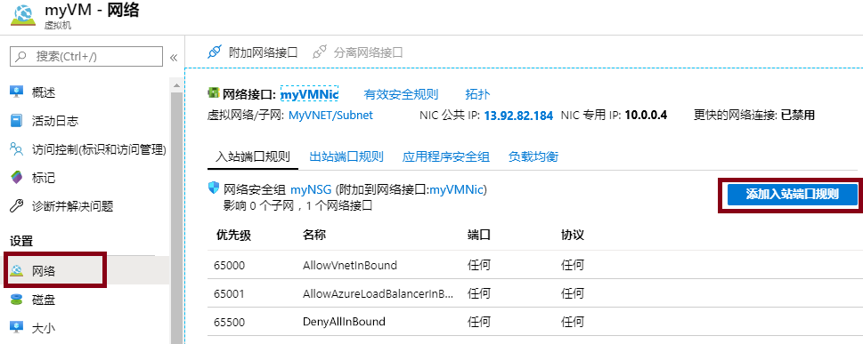

---
wts:
    title: '12 - 确保网络流量安全'
    module: '模块 03 - 安全性、隐私、合规性和信任'
---
# 12 - 确保网络流量安全

在本演练中，我们将创建和配置入站和出站安全端口规则。

预计用时：45 分钟

# 任务 1：创建虚拟机

在此任务中，我们将部署一个创建虚拟机的自定义模板。 

1. 登录至 [Azure 门户](https://portal.azure.com)。

2. 搜索并选择 **部署自定义模板**。

3. 选择 **创建 Windows 虚拟机**。

4. 完成模板。

    | 设置 | 数值 |
    | -- | -- |
    | 订阅 | **选择你的订阅** |
    | 资源组 | **myRGSecure**（新建） |
    | 地点 | **（美国）美国东部** |
    | 管理员用户名 | **azureuser** |
    | 管理员密码 | **Pa$$w0rd1234** |
    | DNS 前缀 | **myrgsecurexxx**（必须唯一） |
    | Windows OS 版本 | 2016-Datacenter |
    | | |

5. 选中 **同意上述条款和条件** 的框。 

6. 单击 **购买**。 

7. 监控部署。创建资源组和虚拟机可能需要几分钟时间。 

8. 在 **通知** 窗口中，选择 **此任务资源**。 

9. 选择 **SimpleWinVM** 虚拟机。

10. 单击 **网络**，并注意消息“此网络接口不包含网络安全组。”

11. 另外，请注意网络接口的名称 **myVMNic**。

# 任务 2：创建网络安全组

在此任务中，我们将创建一个网络安全组并关联网络接口。

1. 在门户中，搜索并选择 **网络安全组**。 

2. 单击 **+添加** 并填写表单。

    | 设置 | 数值 |
    | -- | -- |
    | 订阅 | **选择你的订阅** |
    | 区域 | **（美国）美国东部**  |
    | 资源组 | **myRGSecure** （未设置区域前，此资源组不可用） |
    | 名称 | **myNSGSecure** |
    | | |

3. 单击 **审阅+创建**，然后在验证后单击 **创建**。

4. 创建 NSG 后，选择 **转到资源**。

5. 在 **设置** 下，单击 **网络接口**，然后单击 **关联**。

6. 选择 **myVMNic** 作为你新虚拟机的网络接口。 

# 任务 3：配置入站安全端口规则以允许 RDP

在此任务中，我们将通过配置入站安全端口规则来允许 RDP 进入虚拟机。 

1. 找到你的新虚拟机。 

3. 在 **概述** 窗格中，单击 **连接**。

4. 尝试使用 RDP 连接到虚拟机。默认情况下，网络安全组不允许 RDP。关闭错误窗口。 

    

5. 在 **设置** 下，单击 **网络**，然后单击 **添加入站端口规则**。请注意，这些规则会拒绝虚拟网络（包括负载均衡器）流量以外的所有入站流量。

    

6. 查看入站安全端口规则。请注意允许的内容，并且未列出通过端口 3389 的 RDP。 

6. 单击 **添加入站端口规则**。完成后，单击 **添加**。 

    | 设置 | 数值 |
    | -- | -- |
    | 源 | **任何**|
    | 源端口范围 | * |
    | 目标 | **任意** |
    | 目标端口范围 | **3389** |
    | 协议 | **TCP** |
    | 操作 | **允许** |
    | 优先级 | **300** |
    | 名称 | **允许 RDP** |
    | | |

7. 等待规则部署，然后再次尝试允许 RDP 进入虚拟机。这次你应该会成功。记住用户是 **azureuser**，密码是 **Pa$$w0rd1234**。

# 任务 4：配置出站安全端口规则以拒绝 Internet 访问

在本任务中，我们将创建一个 NSG 并将其与虚拟机关联。然后，我们将拒绝 Internet 访问并进行测试以确保规则有效。

**注意：**在第一个任务中，我们将规则应用到了单个虚拟机。在此任务中，我们将使用可以跨许多资源强制执行规则 NSG。 

1. 在你的虚拟机 RDP 会话中继续。 

2. 计算机启动后，打开 **Internet Explorer** 浏览器。 

3. 确认你可以访问 www.bing.com。你将需要通过 IE 增强安全弹出窗口进行工作。 

**注意：**现在，我们将配置一个规则以拒绝出站 Internet 访问。 

4. 返回门户，找到你的虚拟机。

5. 在 **设置** 下，单击 **网络**，然后单击 **出站端口规则**。

6. 注意有一条规则为 **AllowInternetOutbound**。这是默认规则，无法删除。 

7. 单击 **添加出站安全规则** 并配置具有更高优先级的新出站安全规则，该规则将拒绝 Internet 流量。完成后，单击 **添加**。 

    | 设置 | 数值 |
    | -- | -- |
    | 源 | **任意**|
    | 源端口范围 | * |
    | 目标 | **服务标记** |
    | 目标服务标记 | **Internet** |
    | 目标端口范围 | * |
    | 协议 | **TCP** |
    | 操作 | **拒绝** |
    | 优先级 | **4000** |
    | 名称 | **拒绝 Internet** |
    | | |

8. 返回到你的 RDP 会话。 

9. 浏览到 www.microsoft.com。该页面应该不会显示。 

**注意**：为避免产生额外费用，你可以删除此资源组。搜索资源组，单击你的资源组，然后单击 **删除资源组**。验证资源组的名称，然后单击 **删除**。关注 **通知**，了解删除操作的进度。

