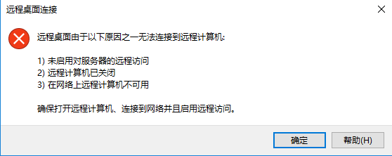

---
wts:
    title: '13 - 保护网络流量（10 分钟）'
    module: '模块 04：介绍常规安全性和网络安全功能'
---
# 13 - 保护网络流量（10 分钟）

在此演练中，我们将配置一个网络安全组。

# 任务 1：创建虚拟机

在此任务中，我们将创建 Windows Server 2019 Datacenter 虚拟机。 

1. 登录到 [Azure 门户](https://portal.azure.com)。

2. 从“**所有服务**”边栏选项卡，搜索并选择“**虚拟机**”，然后单击“**+ 添加**”、“**+ 创建**”、“**+ 新建**”虚拟机。

3. 在 **“基本”** 选项卡上，填写以下信息（保留其他所有设置的默认值）：

    | 设置 | 值 |
    |  -- | -- |
    | 订阅 | **使用提供的默认值** |
    | 资源组 | **创建新的资源组** |
    | 虚拟机名称 | **SimpleWinVM** |
    | 区域 | **（美国）美国东部**|
    | 映像 | **Windows Server 2019 Datacenter Gen 1**|
    | 大小 | **标准 D2s v3**|
    | 管理员帐户用户名 | **azureuser** |
    | 管理员帐户密码 | **Pa$$w0rd1234**|
    | 入站端口规则 | **无**|

4. 切换到 **“联网”** 选项卡，然后配置以下设置：

    | 设置 | 值 |
    | -- | -- |
    | NIC 网络安全组 | **无**|

5. 切换到 **“管理”** 选项卡，然后在其 **“监视”** 部分中选择以下设置：

    | 设置 | 值 |
    | -- | -- |
    | 启动诊断 | **禁用**|

6. 保留其余默认值，然后单击页面底部的 **“查看 + 创建”** 按钮。

7. 验证通过后，单击 **“创建”** 按钮。部署虚拟机大约需要五分钟时间。

8. 监视部署。创建资源组和虚拟机可能需要几分钟时间。 

9. 在部署边栏选项卡或从“通知”区域，单击 **“前往资源”**。 

10. 在 **SimpleWinVM** 虚拟机边栏选项卡上，单击 **“联网”**，查看 **“入站端口规则”** 选项卡，并注意没有与虚拟机的网络接口或网络接口所连接的子网关联的网络安全组。

    **备注**：识别网络接口的名称。在下一个任务中需要使用它。

# 任务 2：创建网络安全组

在本任务中，我们将创建一个网络安全组并将其与网络接口关联。

1. 从“**所有服务**”边栏选项卡，搜索并选择“**网络安全组**”，然后单击 **“+ 添加”、“+ 创建”、“+ 新建”**

2. 在 **“创建网络安全组”** 边栏选项卡的 **“基本”** 选项卡中，指定以下设置：

    | 设置 | 值 |
    | -- | -- |
    | 订阅 | **使用默认订阅** |
    | 资源组 | **请从下拉列表中选择默认值** |
    | 名称 | **myNSGSecure** |
    | 区域 | **（美国）美国东部**  |

3. 单击 **“查看 + 创建”**，然后在验证后单击 **“创建”**。

4. 创建 NSG 后，单击 **“前往资源”**。

5. 在 **“设置”** 下，单击 **“网络接口”**，然后单击 **“+ 关联”**。

6. 选择你在上一个任务中识别的网络接口。 

# 任务 3：配置入站安全端口规则以允许 RDP

在此任务中，我们将通过配置入站安全端口规则来允许虚拟机的 RDP 流量。 

1. 在 Azure 门户中，导航到 **SimpleWinVM** 虚拟机的边栏选项卡。 

2. 在 **“概述”** 窗格中，单击 **“连接”**。

3. 选择“RDP”并下载运行 RDP 的文件，尝试连接到虚拟机。默认情况下，网络安全组不允许 RDP。关闭错误窗口。 

    

4. 在虚拟机边栏选项卡上，向下滚动到“**设置**”部分，单击“**网络**”，然后注意到“**myNSGSecure (附加到网络接口: myVMNic)**”网络安全组的入站规则拒绝除虚拟网络和负载均衡器探测中的流量外的所有入站流量。

5. 在 **“入站端口规则”** 选项卡中，单击 **“添加入站端口规则”**。完成后，单击 **“添加”**。 

    | 设置 | 值 |
    | -- | -- |
    | 源 | **任何**|
    | 源端口范围 | **\*** |
    | 目标 | **任何** |
    | 目标端口范围 | **3389** |
    | 协议 | **TCP** |
    | 操作 | **允许** |
    | 优先级 | **300** |
    | 名称 | **AllowRDP** |

6. 选择“**添加**”并等待预配规则，然后返回到“**连接**”再次尝试通过 RDP 连接到虚拟机。这次应该会成功。记住用户是“**azureuser**”，密码是“**Pa$$w0rd1234**”。

# 任务 4：配置出站安全端口规则以拒绝 Internet 访问

在此任务中，我们将创建会拒绝 Internet 访问的 NSG 出站端口规则，然后对其进行测试以确保该规则正常工作。

1. 在你的虚拟机 RDP 会话中继续。 

2. 计算机启动后，打开 **Internet Explorer** 浏览器。

3. 验证是否可以访问 **https://www.bing.com** 然后关闭 Internet Explorer。你将需要通过 IE 增强安全性弹出窗口进行工作。 

    **备注**：现在，我们将配置一个规则以拒绝出站 Internet 访问。 

4. 回到 Azure 门户中，导航回 **SimpleWinVM** 虚拟机的边栏选项卡。 

5. 在 **“设置”** 下，单击 **“联网”**，然后单击 **“出站端口规则”**。

6. 注意有一条规则为 **“AllowInternetOutbound”**。这是默认规则，无法删除。 

7. 单击 **“myNSGSecure（附加到网络接口：myVMNic）”** 网络安全组右侧的 **“添加出站端口规则”**，然后配置具有更高优先级的新出站安全规则，该规则将拒绝 Internet 流量。完成后，单击 **“添加”**。 

    | 设置 | 值 |
    | -- | -- |
    | 源 | **任何**|
    | 源端口范围 | **\*** |
    | 目标 | **服务标记** |
    | 目标服务标记 | **Internet** |
    | 目标端口范围 | **\*** |
    | 协议 | **TCP** |
    | 操作 | **拒绝** |
    | 优先级 | **4000** |
    | 名称 | **DenyInternet** |

8. 单击“**添加**”。返回到你 RDP 的 VM。 

9. 浏览到 **https://www.microsoft.com** 。该页面应该不会显示。你可能需要通过其他 IE 增强安全性弹出窗口进行工作。

**备注**：为避免产生额外费用，你可以删除此资源组。搜索资源组，单击你的资源组，然后单击 **“删除资源组”**。验证资源组的名称，然后单击 **“删除”**。关注 **“通知”**，了解删除操作的进度。
