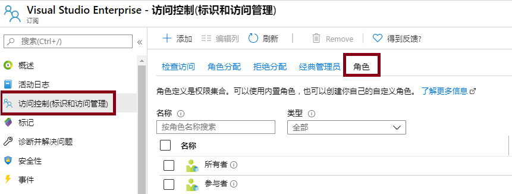
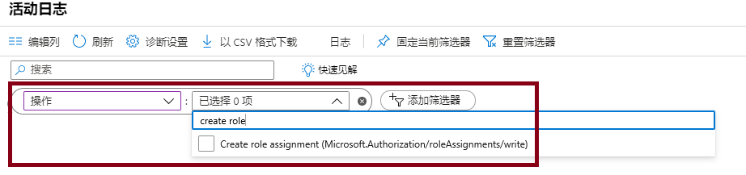

---
wts:
    title: '14 - 使用 RBAC 管理访问权限（5 分钟）'
    module: '模块 05：介绍标识、治理、隐私和合规性功能'
---
# 14 - 使用 RBAC 管理访问权限

在本演练中，我们将分配角色并查看活动日志。 

# 任务 1：查看和分配角色（5 分钟）

在此任务中，我们将分配虚拟机参与者角色。 

1. 登录至 [Azure 门户](https://portal.azure.com)。

2. 搜索并选择 **资源组**，然后单击 **+添加**。

3. 创建新资源组。完成后，单击 **创建**。 

    | 设置 | 数值 |
    | -- | -- |
    | 订阅 | **选择你的订阅** |
    | 资源组 | **myRGRBAC** |
    | 区域 | **（美国）美国东部** |
    | | |

4. 单击 **审阅+创建**，然后单击 **创建**。

5. 单击 **前往资源** 或 **刷新** 资源组页面。 

6. 单击 **访问控制 (IAM)** 边栏选项卡，然后单击 **角色**。滚动浏览大量可用的角色定义。使用信息图标可以了解每个角色的权限。注意，还有关于分配给每个角色的用户和组数信息。

    

7. 返回到 **访问控制 (IAM)** 页面，单击 **角色分配**，然后单击 **+添加**。将自己分配为虚拟机参与者，然后单击 **保存**。 

    | 设置 | 数值 |
    | -- | -- |
    | 角色 | **虚拟机参与者** |
    | 将访问权限分配给 | **用户、组或服务主体** |
    | 选择 | **找到自己** |
    | | |

    **注意：** 通过虚拟机参与者角色，你可以管理虚拟机，但不能访问它们，也不能访问它们所连接的虚拟网络或存储帐户。

    

8. **刷新** 角色分配”页面，并确保你现在列为虚拟机参与者。 

    **注意：** 作为虚拟机参与者，你将能够管理资源组中的虚拟机。这不包括访问计算机或其虚拟网络或存储帐户。 

# 任务 2：监控角色分配并删除角色

在此任务中，我们将查看活动日志以验证角色是否分配，然后删除角色。 

1. 在 Azure 门户中，搜索并选择 **活动日志**。

2. 单击 **添加筛选器**，选择 **操作**，然后选择 **创建角色分配**。

    

3. 验证活动日志是否显示你的角色分配。 

    **注意**：你知道如何删除角色分配吗？

恭喜！你已分配到角色并查看了活动日志。 

**注意**：为避免产生额外费用，你可以删除此资源组。搜索资源组，单击你的资源组，然后单击 **删除资源组**。验证资源组的名称，然后单击 **删除**。关注 **通知**，了解删除操作的进度。

