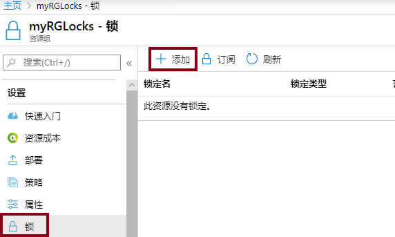
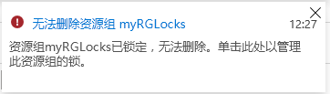
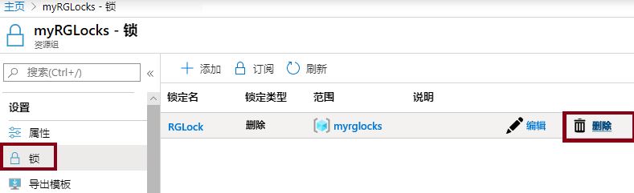

---
wts:
    title: '15 - 管理资源锁（5 分钟）'
    module: '模块 05：介绍标识、治理、隐私和合规性功能'
---
# 15 - 管理资源锁（5 分钟）

在本演练中，我们将向资源组添加一个锁，然后测试删除该资源组。可以将锁应用于订阅中的资源组或单个资源，以防止意外删除或修改关键资源。  

# 任务 1：  向资源组添加锁并测试删除

在此任务中，我们将向资源组添加资源锁，并测试删除该资源组。 

1. 登录到 [Azure 门户](https://portal.azure.com)。

2. 在 Azure 门户中，导航到资源组 **myRGLocks**。

3. 可以将锁应用于订阅、资源组或单个资源，以防止意外删除或修改关键资源。 

4. 在“**设置**”部分，单击“**锁**”，然后单击“**+ 添加**”。 

    

5. 配置新锁。完成后，单击“**确定**”。 

    | 设置 | 值 |
    | -- | -- |
    | 锁名称 | '''RGLock''' |
    | 锁类型 | **删除** |
    | | |

6. 单击“**概述**”，再单击“**删除资源组**”。输入资源组的名称，然后单击“**确定**”。你会收到一条错误消息，指出资源组已锁定，无法删除。

    

# 任务 2：测试删除资源组的成员

在此任务中，我们将测试资源锁是否会保护资源组中的存储帐户。 

1. 在 **“所有服务”** 边栏选项卡中，搜索并选择 **“存储帐户”**，然后单击 **“+ 添加、+ 创建或 + 新建”**。 

2. 在 **“+添加 +新建 +创建”** 边栏选项卡的 **“存储帐户”** 页上，填写以下信息（将存储帐户名称中的 **“xxxx”** 替换为字母和数字，使该名称在全局范围内唯一）。其他设置均保留默认值。

    | 设置 | 值 | 
    | --- | --- |
    | 订阅 | **选择你的订阅** |
    | 资源组 | **myRGLocks** |
    | 存储帐户名称 | **storageaccountxxxx** |
    | 位置 | **（美国）美国东部**  |
    | 性能 | **标准** |
    | 帐户类型 | **StorageV2（常规用途 v2）** |
    | 复制 | **本地冗余存储 (LRS)** |
    | 访问层（默认） | **热** |
   

3. 单击 **“查看 + 创建”** 查看存储帐户设置并允许 Azure 验证配置。 

4. 验证后，单击 **“创建”**。等待告知帐户已创建成功的通知。 

5.  等待告知存储帐户已创建成功的通知。 

6. 访问新存储帐户，然后在 **“概述”** 窗格中，单击 **“删除”**。你会收到一条错误消息，指出资源或其父级具有删除锁。 

    

    **备注**： 虽然我们没有专门为存储帐户创建锁，但是我们确实在包含存储帐户的资源组级别创建了锁。这样，此 *“父级”* 级别的锁会防止我们删除资源，并且存储帐户会从父级继承锁。

# 任务 3：删除资源锁

在此任务中，我们将删除资源锁并进行测试。 

1. 返回到 **“myRGLocks-XXXXXXXX”** 资源组边栏选项卡，然后在 **“设置”** 部分单击 **“锁”**。
    
2. 单击 **“myRGLocks-XXXXXXXX”** 条目极右侧（ **“编辑”** 的右侧）的 **“删除”链接**。

    

3. 返回到存储帐户边栏选项卡，并确认你现在可删除资源。

恭喜！你创建了资源组、向资源组添加了锁并测试了删除、测试了删除资源组中的资源，并且删除了资源锁。 

**备注**：为避免产生额外费用，你可以根据需要删除此资源组。搜索资源组，单击你的资源组，然后单击“**删除资源组**”。验证资源组的名称，然后单击“**删除**”。关注“**通知**”，了解删除操作的进度。
