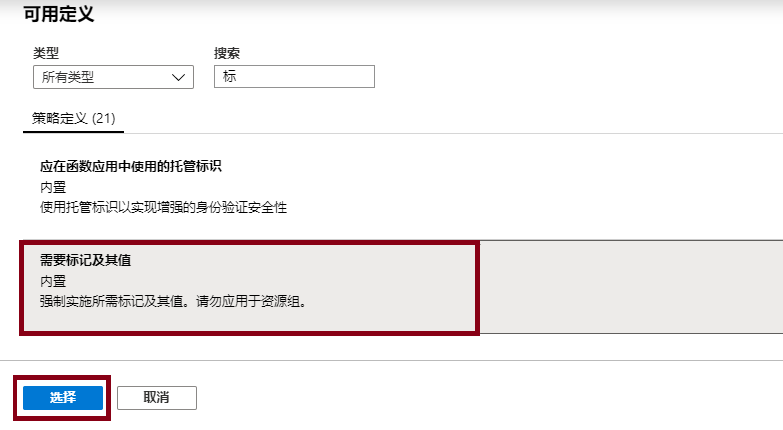
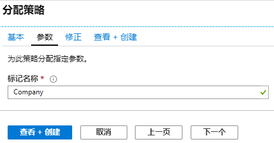
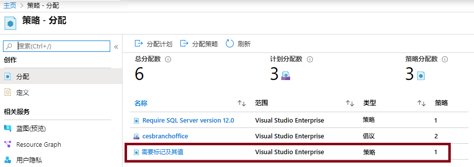
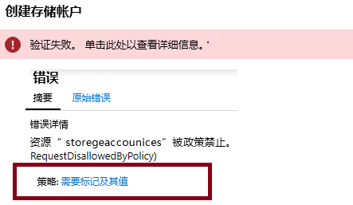
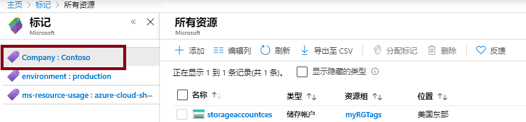
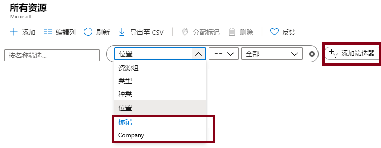

---
wts:
    title: '16 - 实现资源标记（5 分钟）'
    module: '模块 05：介绍标识、治理、隐私和合规性功能'
---
# 16 - 实现资源标记（5 分钟）

在本演练中，我们将创建一个要求标记的策略分配、创建一个存储帐户并测试该标记、查看带有指定标记的资源，并删除该标记策略。

# 任务 1：创建策略分配 

在此任务中，我们将配置 **“资源需要标记”** 策略，并将其分配给我们的订阅。 

1. 登录到 [Azure 门户](https://portal.azure.com)。

2. 在 **“所有服务”** 边栏选项卡中，搜索并选择 **“策略”**。

3. 向下滚动到 **“创作”** 部分，单击 **“分配”**，然后在页面顶部单击 **“分配策略”**。

4. 注意，我们策略的 **“范围”** 覆盖整个订阅。 

5. 在 **“基本”** 下方，选择 **“策略定义”** 省略号按钮（文本框右侧）。在 **“搜索”** 框中，输入值 **tag**。包含 **“tag”** 一词的相关策略列表随即显示。 向下滚动，直至看到 **“资源需要标记”** 定义，单击该定义，然后单击 **“选择”**。

   
   
6. 在 **“参数”** 选项卡上，为标记名称键入 **Company**。为“值”键入 **Contoso**。单击 **“查看 + 创建”**，然后单击 **“创建”**。

    

7. **“资源需要标记”** 策略分配已设置好。创建资源后，资源必须包含具有 Company 密钥的标记。
   **注意 - 你需要等待 30 分钟才能应用策略。** 

   

# 任务 2：创建一个存储帐户以测试所需的标记

在此任务中，我们将创建存储帐户以测试所需的标记。 

1. 在 Azure 门户的“**所有服务**”边栏选项卡中，搜索并选择“**存储帐户**”，然后单击“**+ 添加”、“+ 创建”、“+ 新建**”。

2. 在 **“创建存储帐户”** 边栏选项卡的 **“基本”** 选项卡上，填写以下信息（将存储帐户名称中的 **“xxxx”** 替换为字母和数字，使该名称在全局范围内唯一）。其他设置均保留默认值。

    | 设置 | 值 | 
    | --- | --- |
    | 订阅 | **使用提供的默认值** |
    | 资源组 | **创建新的资源组** |
    | 存储帐户名称 | **storageaccountxxxx** |
    | 位置 | **（美国）美国东部** |

3. 单击 **“查看 + 创建”**。 

    **备注：** 我们将测试未提供标记时会发生什么。请注意，策略最多可能需要 30 分钟才能生效。

4. 你将收到一条说明验证失败的消息。单击 **“单击此处查看详细信息”** 消息。在 **“错误”** 边栏选项卡的 **“摘要”** 选项卡上，请记下说明策略不允许资源的错误消息。

    **备注：** 如果查看“原始错误”选项卡，将看到要求的特定标记名称。 

    

5. 关闭 **“错误”** 窗格并单击 **“上一步”** （屏幕底部）。提供标记信息。 

    | 设置 | 值 | 
    | --- | --- |
    | 标记名称 | **Company** （可能不在下拉列表中） |

6. 单击 **“查看 + 创建”**，验证是否已成功验证。单击 **“创建”** 以部署存储帐户。 

# 任务 3：查看带有特定标记的所有资源

1. 在 Azure 门户的 **“所有服务”** 边栏选项卡中，搜索并选择 **“标记”**。

2. 记下所有标记及其值。单击 **“Company:  Contoso”** 键/值对。这将显示一个边栏选项卡，其中显示新创建的存储帐户，但前提是你在部署期间包含了此标记。 

   

3. 在门户中，显示 **“所有资源”** 边栏选项卡。

4. 单击 **“添加筛选器”**，然后添加 **Company** 标记密钥作为筛选类别。应用筛选器后，将仅列出你的存储帐户。

    

# 任务 4：删除策略分配

在此任务中，我们将删除 **“资源需要标记”** 策略，以免影响我们后续的工作。 

1. 在门户的 **“所有服务”** 边栏选项卡中，搜索并选择 **“策略”**。

2. 单击 **“资源需要标记”** 策略条目。

3. 在顶部菜单中单击 **“删除分配”**。

4. 通过在 **“删除分配”** 对话框中单击 **“是”**，确认希望删除策略分配

5. 如果有时间，请尝试创建另一个不含标记的资源以确保该策略不再有效。

恭喜！在本演练中，我们创建了一个要求标记的策略分配、创建了一个资源（存储帐户）并测试了该标记的策略、查看了带有指定标记的资源，并删除了该标记策略。

**备注**：为避免产生额外费用，你可以根据需要删除此资源组。搜索资源组，单击你的资源组，然后单击“**删除资源组**”。验证资源组的名称，然后单击“**删除**”。关注“**通知**”，了解删除操作的进度。
