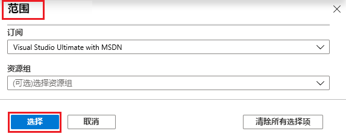
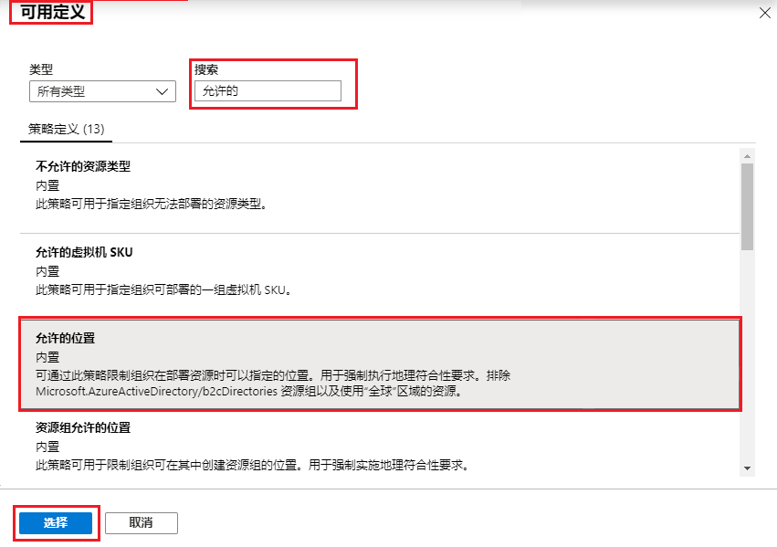
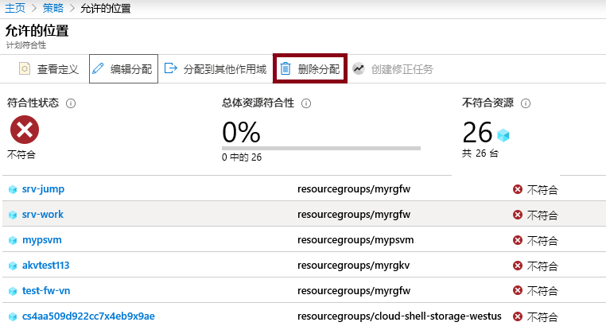

---
wts:
    title: '17 - 创建 Azure 策略（10 分钟）'
    module: '模块 05：介绍标识、治理、隐私和合规性功能'
---
# 17 - 创建 Azure 策略（10 分钟）

在本演练中，我们将创建一个 Azure 策略，以将 Azure 资源的部署限制到特定位置。

# 任务 1：创建策略分配 

在此任务中，我们将配置“允许的位置”策略并将其分配给我们的订阅。 

1. 登录到 [Azure 门户](https://portal.azure.com)。

2. 在“**所有服务**”边栏选项卡中，搜索并选择“**策略**”，在“**创作**”部分，单击“**定义**”。  花一点时间查看内置策略定义列表。例如，在“**类别**”下拉列表中，仅选择“**计算**”。注意，利用“**允许的虚拟机大小 SKU**”定义，可以指定组织可部署的一组虚拟机 SKU。

3. 返回到 **“策略”** 页面，在 **“创作”** 部分下单击 **“分配”**。分配是将策略分配到特定范围。例如，可以将定义分配给订阅范围。 

4. 单击 **“策略 - 分配”** 页面顶部的 **“分配策略”**。

5. 在“**分配策略**”页上，保留默认选项。

      | 设置 | 值 | 
    | --- | --- |
    | 范围| 使用默认订阅|
    | 策略定义 | 单击省略号，然后搜索“**允许的位置**”，然后**选择** |
    | 分配名称 | **允许的位置** |
    
    
6. 在“**参数**”选项卡中，选择 **“日本西部**”。单击“**查看 + 创建**”，然后再单击“**创建**”。

    **备注**：范围确定策略分配将应用到的资源或资源组。在本例中，我们可以将此策略分配给特定的资源组，但我们选择在订阅级别分配该策略。请注意，可以根据范围配置排除资源。排除是可选的。

    **备注**：这一 **“允许的位置”** 策略定义将指定所有资源必须部署到的位置。如果选择其他位置，将不允许部署。有关详细信息，请参阅 [Azure 策略示例](https://docs.microsoft.com/zh-cn/azure/governance/policy/samples/index)页面。

   

9. **“允许的位置”** 策略分配现已列在 **“策略 - 分配”** 窗格中，该策略已设置好，可在我们指定的范围级别（订阅级别）强制执行该策略。

# 任务 2：测试“允许的位置”策略

在此任务中，我们将测试“允许的位置”策略。 

1. 在 Azure 门户的“**所有服务**”边栏选项卡中，搜索并选择“**存储帐户**”，然后单击“**+ 创建**”。

2. 配置存储帐户（将存储帐户名称中的 **“xxxx”** 替换为字母和数字，使该名称在全局范围内唯一）。其他设置均保留默认值。 

    | 设置 | 值 | 
    | --- | --- |
    | 订阅 | **使用支持的默认值** |
    | 资源组 | **myRGPolicy** （新建） |
    | 存储帐户名称 | **storageaccountxxxx** |
    | 位置 | **（美国）美国东部** |

3. 单击 **“查看 + 创建”**，然后单击 **“创建”**。 

4. 你将收到说明策略不允许资源的“**部署失败**”错误，其中包含“**允许的位置**”策略名称。

# 任务 3：删除策略分配

在此任务中，我们将删除“允许的位置”策略分配并进行测试。 

我们将删除策略分配，确保在以后需要做的任何工作中不会受阻。

1. 在 **“所有服务”** 边栏选项卡中，搜索并选择 **“策略”**，然后单击 **“允许的位置”** 策略。

    **备注**： 在 **“策略”** 边栏选项卡上，你可以查看已分配的各种策略的合规性状态。

    **备注**： “允许的位置”策略可能会显示不合规资源。如果出现这种情况，就表示这些资源先于策略分配创建。
 
2. 单击“允许的位置”。将打开“**允许的位置策略合规性**”窗口。

3. 在顶部菜单中单击“**删除分配**”。单击“**是**”，确认删除策略分配

   

4. 尝试创建另一个存储帐户，确保该策略不再有效。

    **备注**： **“允许的位置”** 策略适用于以下常见场景： 
    - *成本跟踪*： 你可以在不同的区域位置使用不同的订阅。此策略将确保所有资源都部署到目标区域以帮助进行成本跟踪。 
    - *数据驻留和安全合规性*：你还可能具有数据驻留要求，按客户或特定的工作负载创建订阅，并定义所有资源必须部署在特定数据中心中，以确保满足数据和安全合规性要求。

恭喜！你已创建一个 Azure 策略，用于将 Azure 资源的部署限制在特定数据中心。

**备注**：为避免产生额外费用，你可以根据需要删除此资源组。搜索资源组，单击你的资源组，然后单击“**删除资源组**”。验证资源组的名称，然后单击“**删除**”。关注“**通知**”，了解删除操作的进度。
