---
wts:
    title: '19 - 使用 Azure 定价计算器（10 分钟）'
    module: '模块 06：介绍 Azure 成本管理和服务级别协议'
---
# 19 - 使用 Azure 定价计算器（10 分钟）

在本演练中，我们将使用 Azure 定价计算器生成 Azure 虚拟机和相关网络资源的成本估算。

# 任务 1：配置定价计算器

在此任务中，我们将使用 Azure 定价计算器来估算示例基础结构的成本。 

**备注**：为创建 Azure 定价计算器估算，本演示提供了 VM 和相关资源的示例配置。使用此示例配置或在 Azure 定价计算器中提供有关你*实际*资源要求的详细信息。

1. 在浏览器中，导航至 [Azure 定价计算器](https://azure.microsoft.com/zh-cn/pricing/calculator/)网页。

2. 要添加 VM 配置的详细信息，请在 **“产品”** 选项卡上单击 **“虚拟机”**。向下滚动以查看虚拟机的详细信息。 

3. 将 **“你的估算”** 和 **“虚拟机”** 文本替换为 Azure 定价计算器估算和 VM 配置的更具描述性的名称。本演示示例使用 **“我的定价计算器估算”** 进行估算，**Windows VM** 进行 VM 配置。

   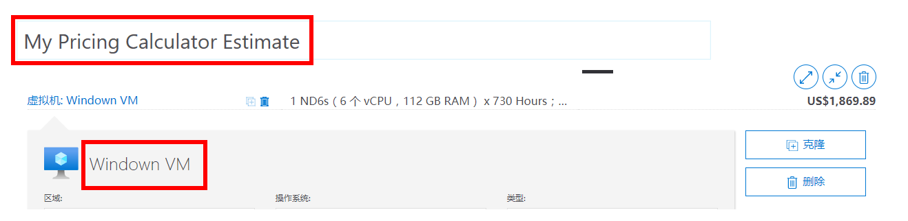

4. 修改默认的 VM 配置。

    | 设置 | 值 |
    | -- | -- |
    | 区域 | **北欧** |
    | 操作系统 | **Windows** |
    | 类型 | **（仅限 OS）** |
    | 层 | **标准** |  
    | 实例 | **A2：2 个核心，3.5 GB RAM，135 GB 临时存储** |

   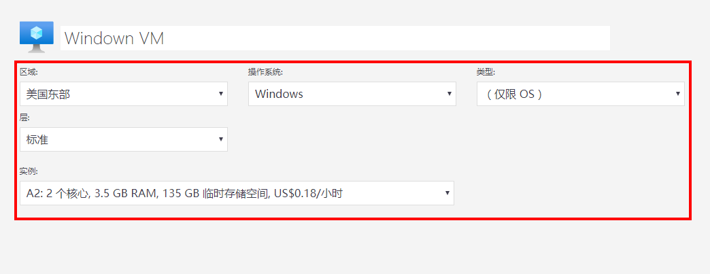

    **备注**：VM 实例规范和定价可能与此示例中的不同。通过选择与示例尽可能匹配的实例来完成本演示。要查看有关不同 VM 产品选项的详细信息，请在右侧 **“更多信息”** 菜单中选择 **“产品详细信息”**。

5. 设置 **“计费选项”** 为 **“即用即付”**。

   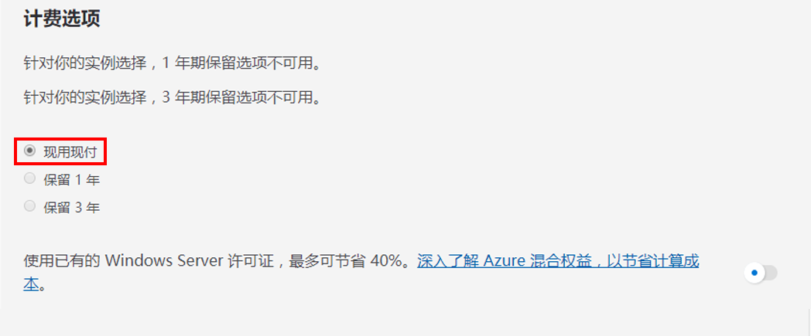

6. 在 Azure 中，一个月定义为 730 小时。如果你的 VM 需达到每月 100％ 的时间可用，请将每月小时数值设置为 `730`。本演练示例要求一个 VM 每月 50％ 的时间可用。

    将 VM 的数量设置为 `1`，并将每月小时数值更改为 `365`。

   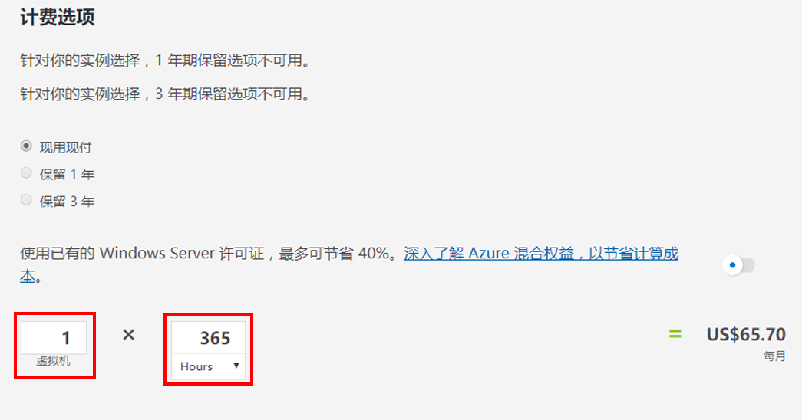

7. 在 **“托管的 OS 磁盘”** 窗格中，修改默认的 VM 存储配置。

    | 层 | 磁盘大小 | 磁盘数量 | 快照 | 存储事务 |
    | ---- | --------- | --------------- | -------- | -------------------- |
    | 标准 HDD | S30：1024 GiB | 1 | 关闭 | 10,000 |

   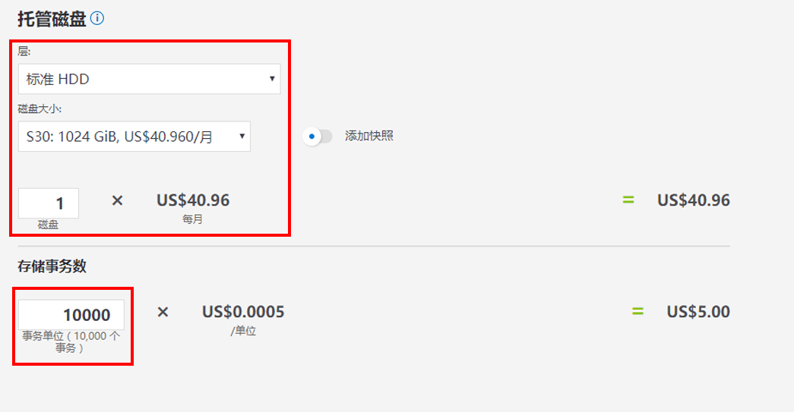

8. 要为估算添加网络带宽，请前往 “Azure 定价计算器”网页顶部。在左侧“产品”菜单中单击 **“网络”**，然后单击 **“带宽”** 磁贴。在 **“已添加带宽”** 消息对话框中，单击 **“查看”**。

   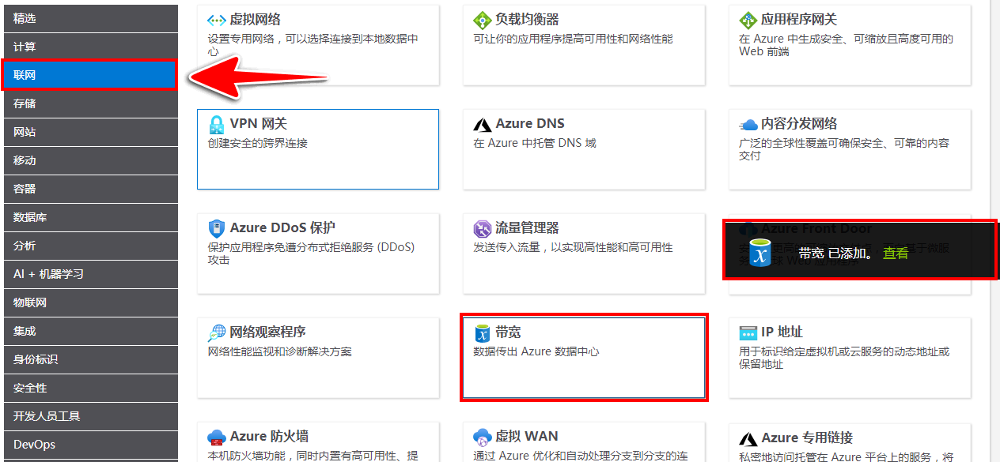

9. 添加 VM 带宽配置名称。本演示示例使用名称 **“带宽: Windows VM”**。通过添加以下详细信息来修改默认带宽配置。

    | 区域 | 区域 1 出站数据传输量 |
    | ------ | -------------------------------------- |
    | 北欧 | 50 GB |

   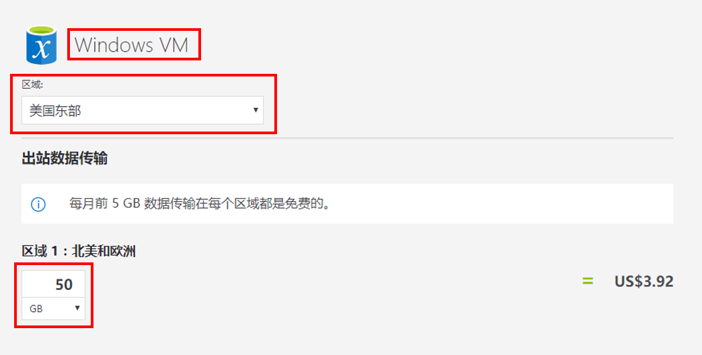

10. 若要添加“应用程序网关”，请返回“Azure 定价计算器”网页的顶部。在 **“网络”** 产品菜单中，单击 **“应用程序网关”** 磁贴。在 **“应用程序网关”** 消息对话框中，单击 **“查看”**。

    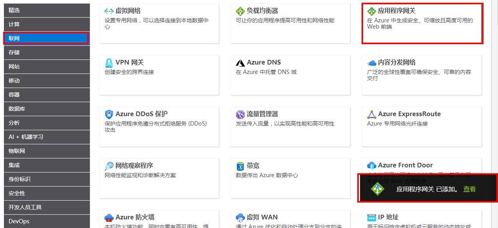

11. 添加应用程序网关配置名称。本演示使用名称 **“应用程序网关: Windows VM”**。通过添加以下详细信息来修改默认应用程序网关配置。

    | 设置 | 值 |
    | -- | -- |
    | 区域 | **北欧** |
    | 层 | **基本** |
    | 大小 | **小** |
    | 实例 | **1** |  
    | 小时 | **365** |
    | 已处理数据 | **50 GB** |
    | 区域 1：北美，欧洲 | **50 GB**|

    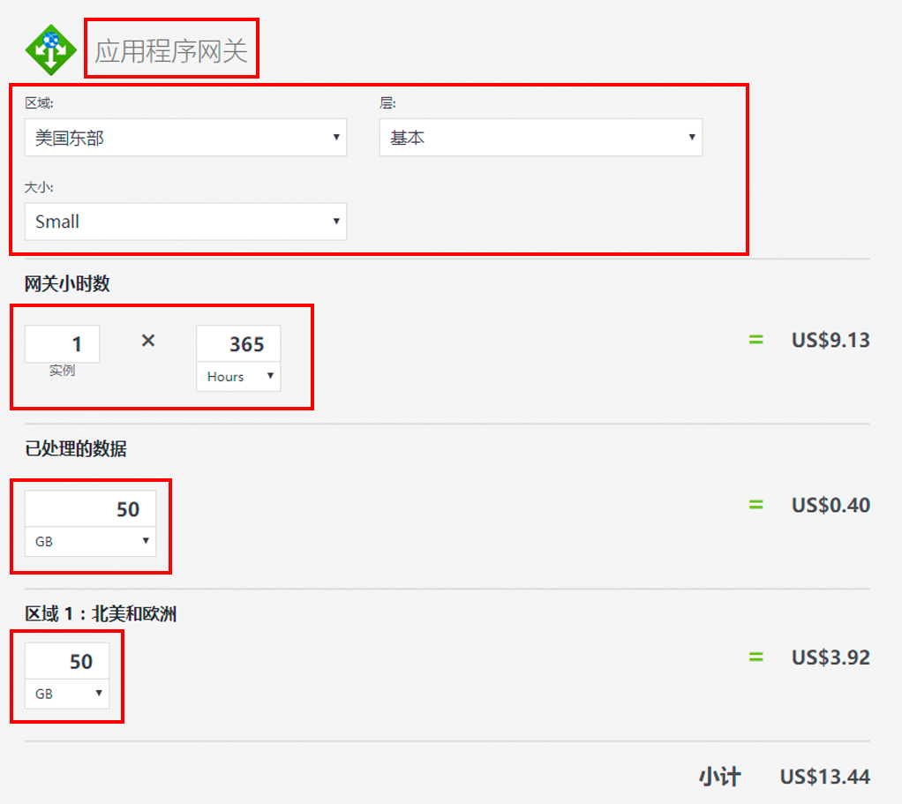

# 任务 2：查看定价估算

在此任务中，我们将查看 Azure 定价计算器的结果。 

1. 滚动到 Azure 定价计算器网页底部，查看 **“每月估算成本”**。

    **备注**：浏览 Azure 定价计算器中提供的各种选项。例如，本次演示要求你将货币更新为欧元。

2. 将货币更改为欧元，然后选择 **“导出”** 以下载 Microsoft Excel (`.xlsx`) 格式的估算副本，以供离线查看。

    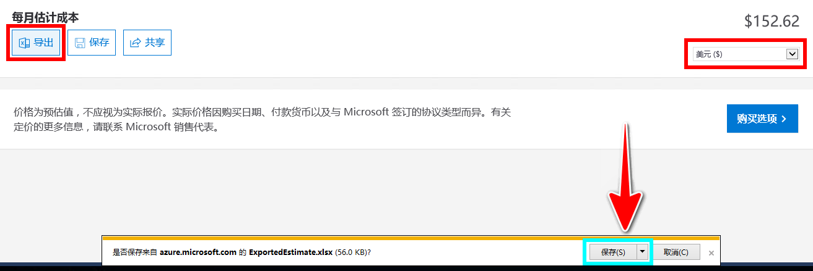

    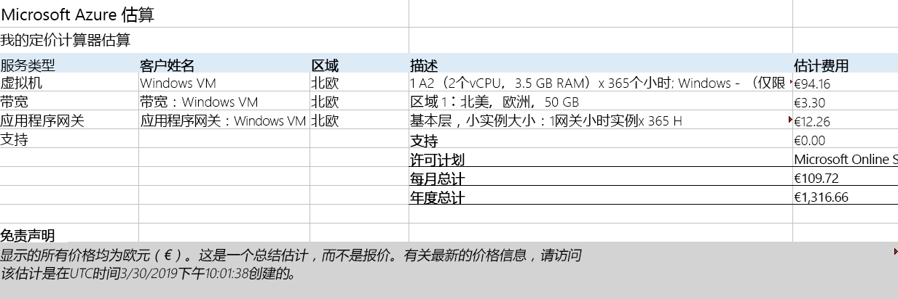

恭喜！你从 Azure 定价计算器下载了估算。
