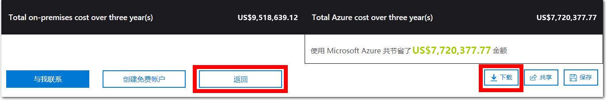

---
wts:
    title: '20 - 使用 Azure TCO 计算器（10 分钟）'
    module: '模块 06：介绍 Azure 成本管理和服务级别协议'
---
# 20 - 使用 Azure TCO 计算器（10 分钟）

在本演练中，你将使用总拥有成本 (TCO) 计算器来生成本地环境的成本比较报告。

**备注**：本演练提供了典型数据中心的本地基础结构和工作负载的示例定义。要创建 TCO 计算器报告，请使用示例定义或提供你的*实际*本地基础结构和工作负载的详细信息。

# 任务 1：配置 TCO 计算器

在此任务中，我们将向计算器添加基础结构信息。 

1. 在浏览器中，导航到[总拥有成本 (TCO) 计算器](https://azure.microsoft.com/zh-cn/pricing/tco/calculator/)页面。

2. 要添加本地服务器基础结构的详细信息，请在 **“定义工作负载”** 窗格中单击 **“+ 添加服务器工作负载”**。

    | 设置 | 值 |
    | -- | -- |
    | 名称 | **服务器：Windows VM** |
    | 工作负载 | **Windows/Linux 服务器** |
    | 环境 | **虚拟机** |
    | 操作系统 | **Windows** |  
    | VM | **50** |
    | 虚拟化 | **Hyper-V** |
    | 核心数 | **8**|
    | RAM (GB) | **16** |
    | 优化方式 | **CPU** |
    | Windows Server 2008/2008 R2 | **关闭** |

3. 选择 **“+ 添加服务器工作负载”** 为新的服务器工作负载定义创建一行。 

    | 设置 | 值 |
    | -- | -- |
    | 名称 | **服务器：Linux VM** |
    | 工作负载 | **Windows/Linux 服务器** |
    | 环境 | **虚拟机** |
    | 操作系统 | **Linux** |  
    | VM | **50** |
    | 虚拟化 | **VMware** |
    | 核心数 | **8**|
    | RAM (GB) | **16** |
    | 优化方式 | **CPU** |
    | Windows Server 2008/2008 R2 | **关闭** |

4. 在 **“存储”** 窗格中，单击 **“添加存储”**。

    | 设置 | 值 |
    | -- | -- |
    | 名称 | **服务器存储** |
    | 存储类型 | **本地磁盘/SAN** |
    | 磁盘类型 | **HDD** |
    | 容量 | **60 TB** |  
    | 备份 | **120 TB** |
    | 存档 | **0 TB** |

5. 在 **“联网”** 窗格中，添加带宽。 

    | 设置 | 值 |
    | -- | -- |
    | 出站带宽 | 15 TB|

6. 单击 **“下一步”**。

7. 浏览选项并按需调整。 

    | 设置 | 值 |
    | -- | -- |
    | 货币 | **欧元** |

8. 单击 **“下一步”**。

# 任务 2：查看结果并保存副本

在此任务中，我们将查看成本节约建议并下载报告。 

1. 查看 Azure 成本节约建议和可视化效果。

    | 设置 | 值 |
    | -- | -- |
    | 时间范围| **3 年** |
    | 区域 | **北欧** |

2. 要修改你提供的信息，请转到页面底部，然后单击 **“上一步”**。 

3. 要保存或打印报告的 PDF 副本，请单击 **“下载”**。

    

恭喜！你已使用 TCO 计算器生成本地环境的成本比较报告。
