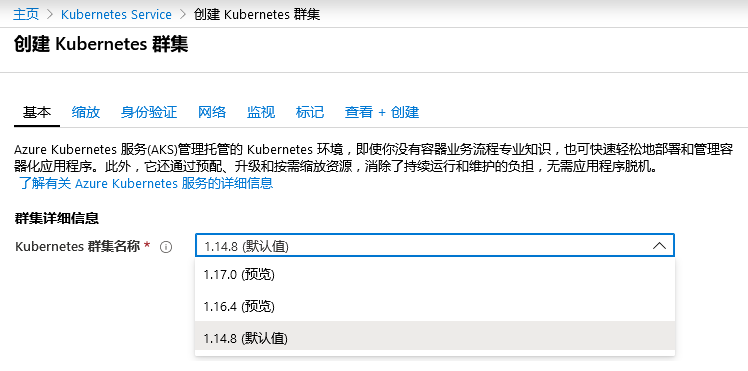
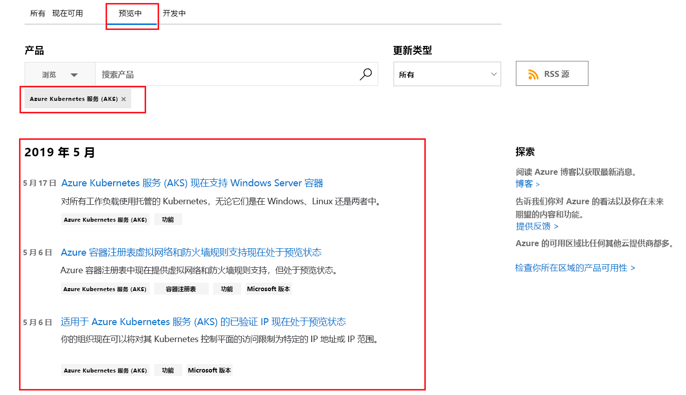

---
wts:
    title: '23 - 访问 Azure 预览功能'
    module: '模块 04 - Azure 定价和支持'
---

# 23 - 访问 Azure 预览功能

在本演练中，我们将访问并识别 Azure 预览服务和功能，并查看最新的 Azure 更新信息。

预计用时：10 分钟

# 任务 1：访问预览服务和功能

在此任务中，我们将查看市场预览功能。 

1. 登录至 [Azure 门户](https://portal.azure.com)。

2. 搜索并选择 **市场**。 

3. 在“市场”中搜索 **预览**。查看感兴趣的所有预览产品。 

4. 在“市场”中搜索 **Kubernetes 服务**。选择 Kubernetes 服务，然后单击 **创建**。

5. 在 **Kubernetes 版本** 下拉列表中，注意有一个 **预览** 版本。并非所有服务都具有预览版本。 

    

    **注意**：若现有正式发布的 Azure 服务或产品中提供了可用的新功能或特性，虽然你可能在生产中使用 Azure 服务，但预览功能或特性也可能尚不支持生产部署。并且，在部署到生产之前，应务必了解其使用方面的所有限制。

# 任务 2：查看“Azure 更新”页面

在此任务中，我们将查看“Azure 更新”页面。

1. 在浏览器中，前往 [Azure 更新](https://azure.microsoft.com/zh-cn/updates/) 页面。 

2. 注意存在着四个选项卡选项，即 **所有**、**现在可用**、**预览中** 和 **开发中**

3. 点击 **预览中** 选项卡并在搜索框的搜索中键入 **Kubernetes**，然后在出现提示时选择“Azure Kubernetes 服务 (AKS)”。该页面会返回与 Kubernetes 相关的预览项列表。你的结果列表可能不同。 

    

4. 单击结果列表中的任意一项可获取更多详细信息。 

5. 返回到 **Azure 更新** 页面，通过单击 **现在可用** 并注意现在显示的项，即可查看状态为 **正式发布** 的项。浏览感兴趣的任何内容。

6. 返回到 **Azure 更新** 页面，单击 **开发中** 选项卡并请注意当前正在开发中的返回项。浏览感兴趣的任何内容。

恭喜！你已访问并标识 Azure 预览服务和功能，并查看了最新的 Azure 更新信息。

